# A write-up that uses AI and a bit of brains

In this write-up, we are using Cline as MCP client. Cline is a plugin of Visual Studio Code. We configure Cline to connect to a MCP server of *Streamable HTTP* type on http://URL:PORT/mcp.

Once this is setup, we are able to see the available tools it offers:

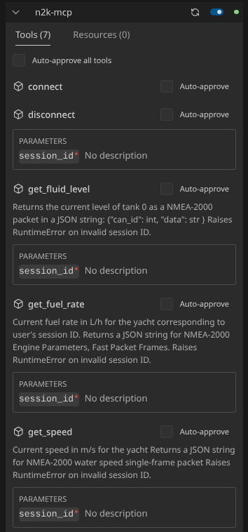

We start a session with a prompt stating we need to empty a tank. In this write-up, we used a free model, mistral-medium-latest, which is not able to read PDF files, so we encourage the AI to ask us for any details about NMEA 2000 that we will read ourselves from the supplied documentation.

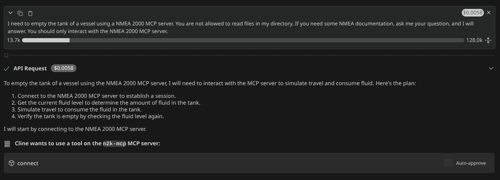

## Tank level

The AI works out 4 reasonable tasks to empty the task and check.
For any interaction with this MCP server, we need a UUID which is supplied by `connect()`. The AI automatically calls `connect()` and then `get_fluid_level()` to read our tank capacity and level.

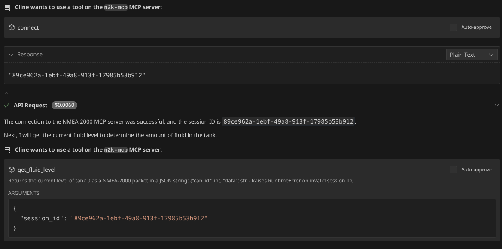

The AI asks us for details about PGN 127505 that we detail from the supplied documentation. 

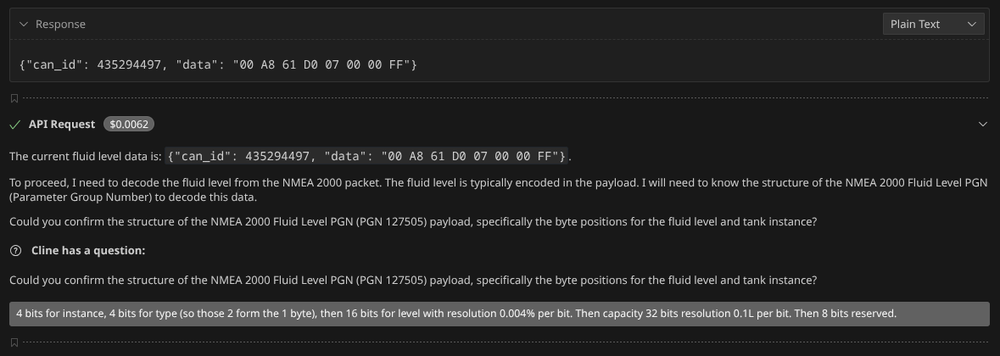

At first, the AI doesn't interpret the values correctly because we haven't mentioned it's little endian. We fix that and then it works out a correct **level of 100%**.

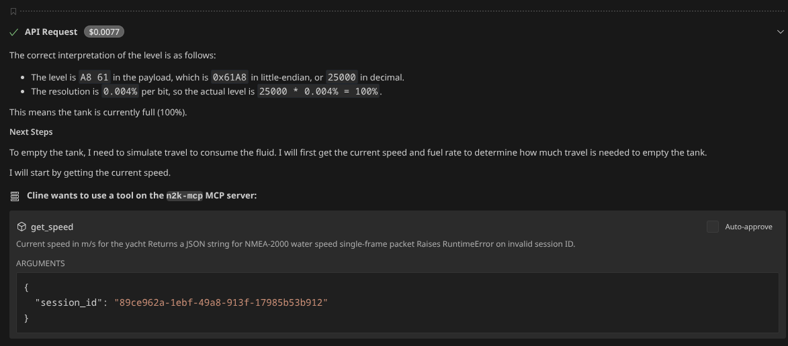

Note that in this iteration it forgot to compute the **tank capacity**, we'll see that later.

## Get speed

Our current session has expired, so call to `get_speed()` fails. The AI automatically works out to re-connect.

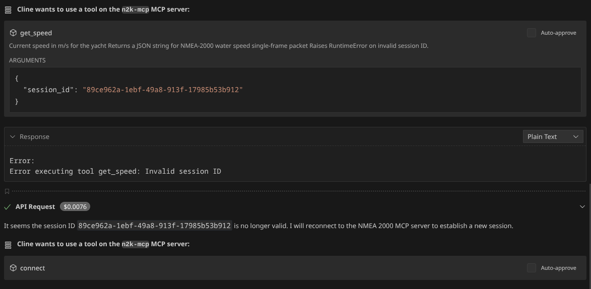
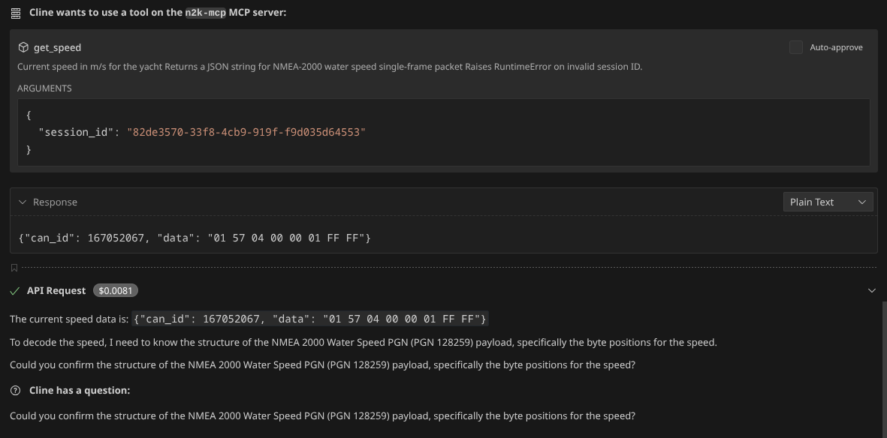

Now, `get_speed()` works, but the AI asks us about the details for PGN 128259.
Based on the information, it computes the speed of the vessel.

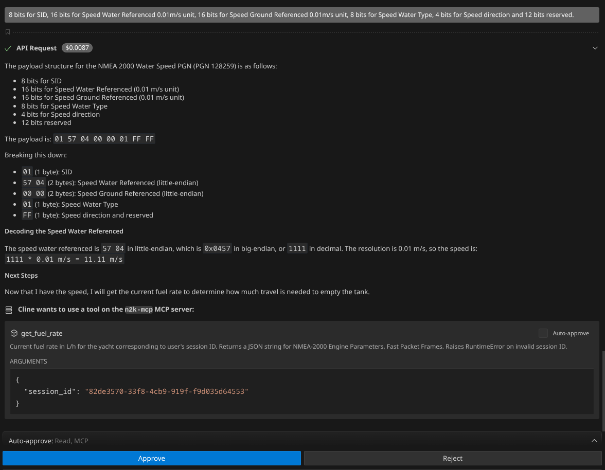

## Get fuel rate

The answer of `get_fuel_rate()` is more complicated because it doesn't fit on 8 bytes and consequently requires Fast Packet formatting. This is explained in the documentation supplied to us.

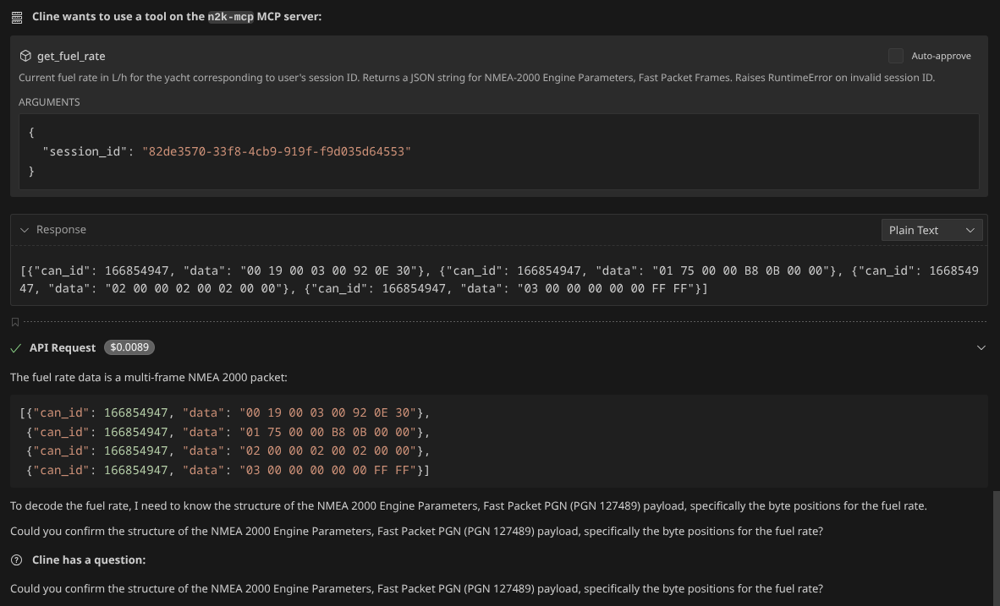

We copy/paste the relevant section from the documentation + the description of the PGN.

```
Packet framing
NMEA 2000 messages that are 8 bytes or less can be transmitted in a single CAN frame. For messages of 9 or more bytes there is an ISO 11783 defined method called Transport Protocol that can be used to transmit up to 1785 bytes. See PGN 60416. This is not generally used though. What is used is an alternative method with less overhead and less complexity for the sender. This is called fast packet framing.

In fast packet framing, the first packet contains two protocol bytes and six data bytes. Following packets contain one protocol byte and seven data bytes. Up to 32 packets can be used for a single message so the total maxing data length is 6 + 31 * 7 = 223 bytes. The first byte in all frames contains a sequence counter in the high 3 bits and a frame counter in the lower 5 bits. The second byte in the first frame contains the total number of bytes in all packets that will be sent (excluding the single header byte in each of the following packets). 
```

The AI works out the payload, but incorrectly understands it.  

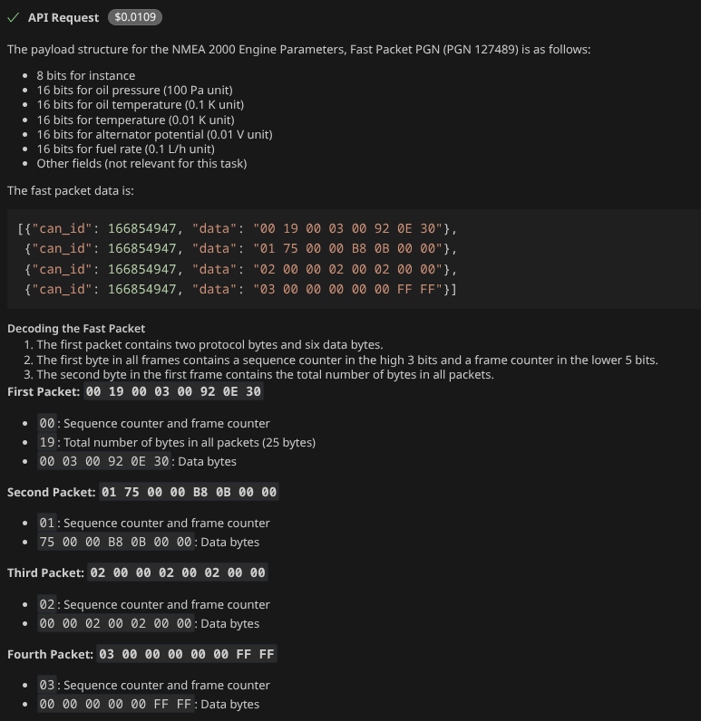

We fix its understanding, and then it computes the fuel rate correctly: **300 L/h**.

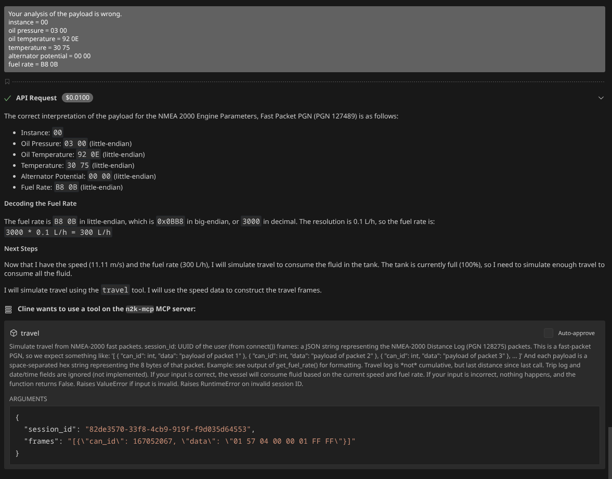

## Simulating a travel

The AI wants to simulate a travel to empty the tank. It encounters several issues.
First, it struggles to format the CAN ID correctly, and the MCP server consequently does not read the expected PGN value from the input. 

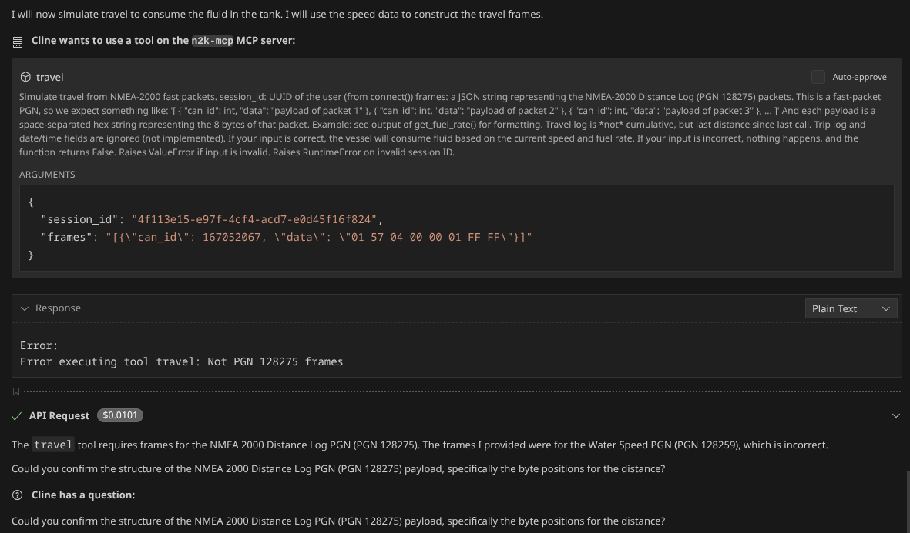

It confirms `travel()` is expecting PGN 128275.

A CAN ID is formatted as such (for global PGNs) - [see here](https://kvaser.com/about-can/higher-layer-protocols/j1939-introduction/):

```
CAN_ID=(prio<<26)∣(R<<25)∣(DP<<24)∣(PF<<16)∣(PS<<8)∣SA
```

where, for PGN 128275,

- priority is normally 6 (not a high priority)
- R is a reserved bit set to 0
- DP, PF and PS concatenated are the PGN
- SA is the source address

We don't know the source address, and we can just forge one, or re-use one from a former packet. For example, `get_fluid_level()` used a CAN ID = 435294497 = 0x19F21121. This has a source address of 0x21. For `get_fuel_rate()`, the source address is 0x23.

The AI struggle yet and again with the CAN ID: bad hex conversion + in the example below, it uses a source address of 0x03 - which could have been an issue, but actually it seems the MCP server doesn't care about the source address :)

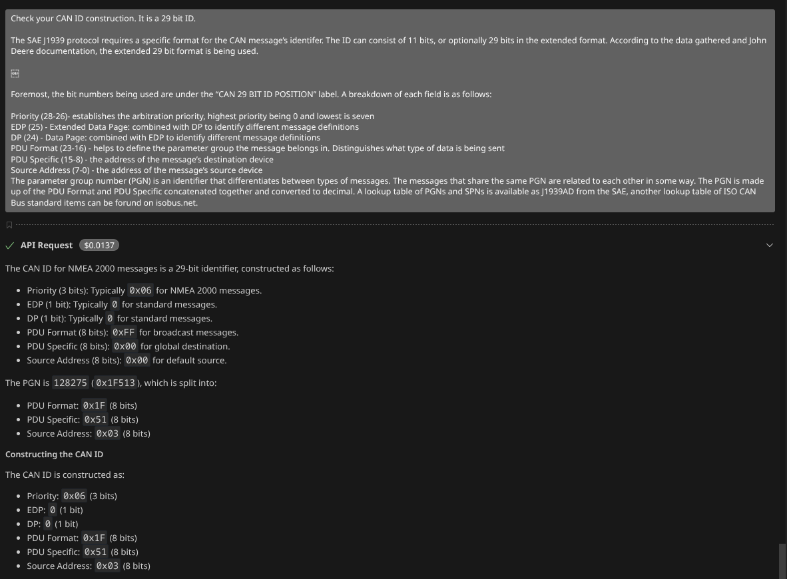

Finally, we get the correct CAN ID, but this time, the server complains that the travel distance is not realistic.

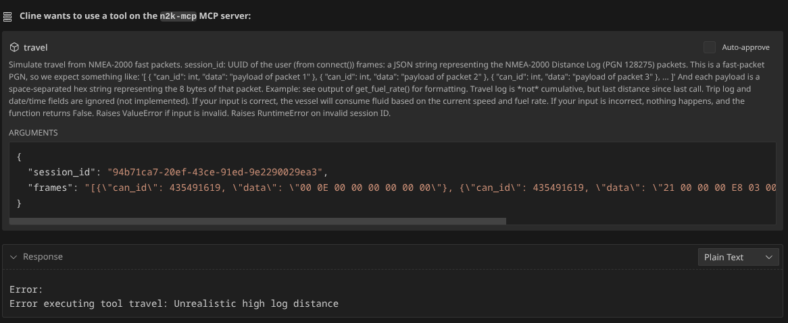

Recall that for fluid levels, the AI forgot to compute the tank's capacity and *assumed it would be 1000 L*. This is a wild guess and it's absolutely incorrect, so we have it compute the real capacity, and consequently travel for a more realistic distance.

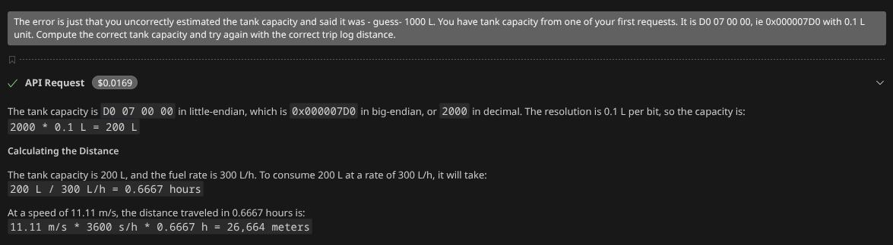

At this stage, it completely mixes up the Fast Packet formatting. It creates packets of different sequences where each packet should be a different frame of the same sequence.

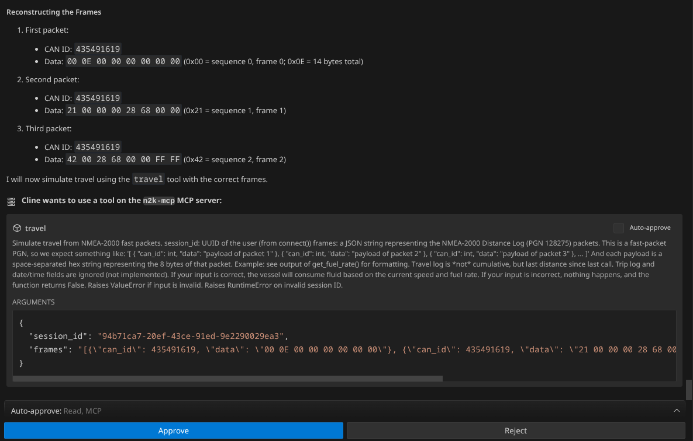

We finally get a correct command:

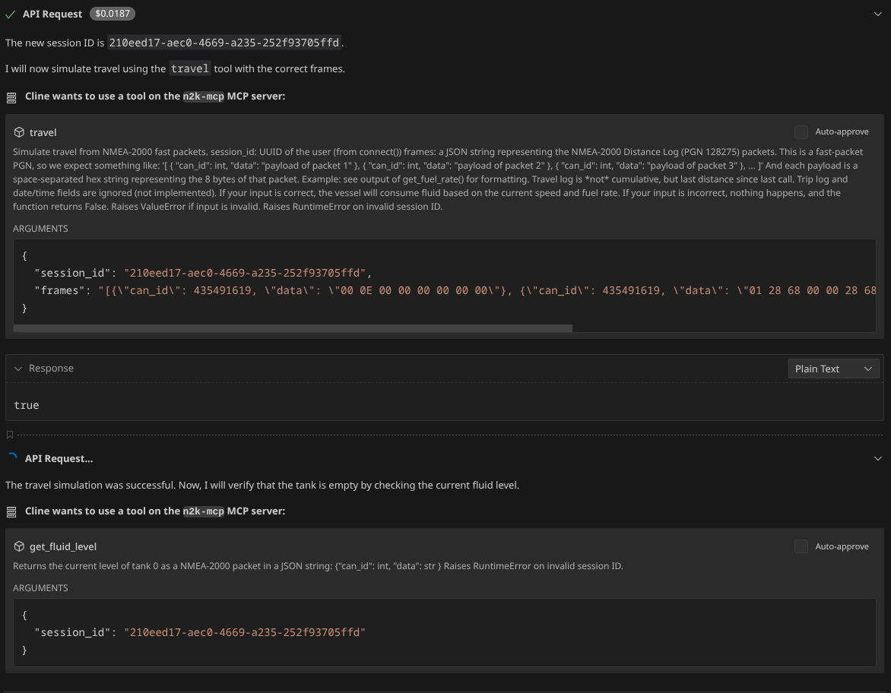

## Checking new capacity

The AI wants to check if the travel emptied the tank. And it did :)

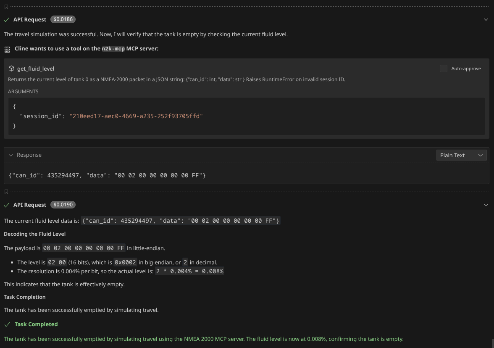

But we need a flag. We could honestly have worked out to call `alert()` on our own here, but we act dump and the AI works it out.

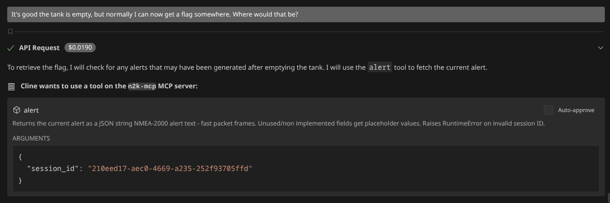

The AI misreads the flag to `{REDACTED}`, but that's sufficiently striking for us to investigate and find the full flag.

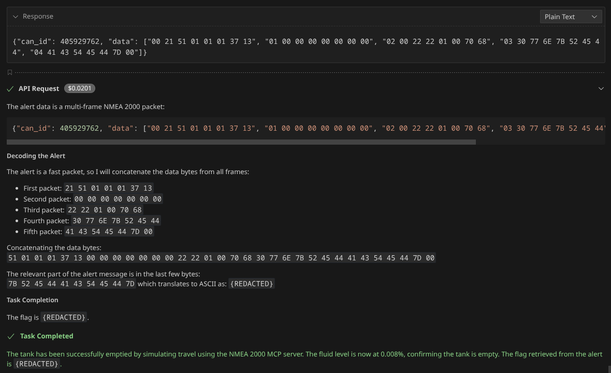
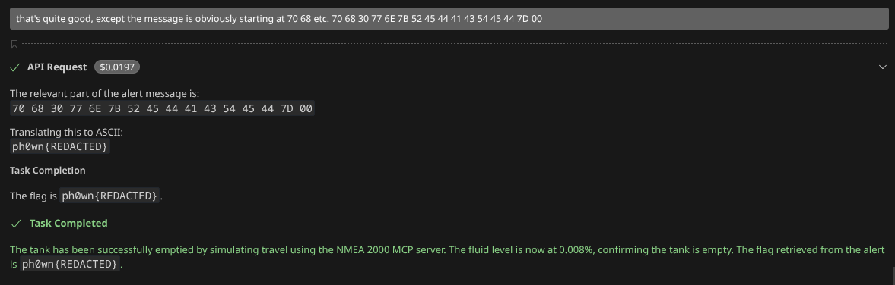


