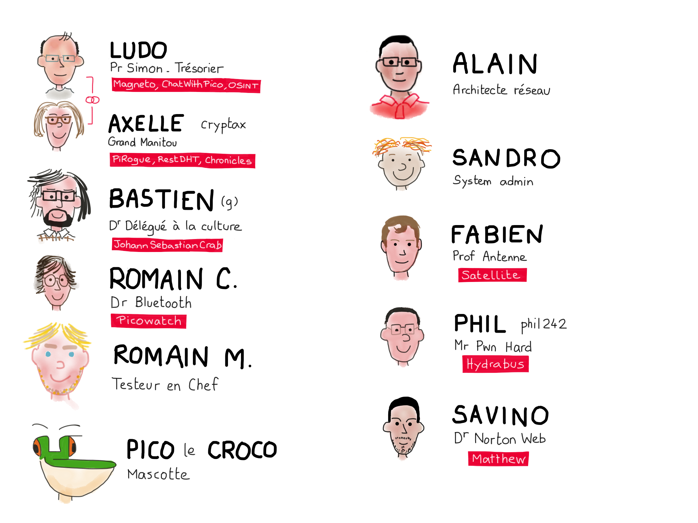

---
title: Ph0wn eMagazine, issue \#01
subtitle: https://ph0wn.org, November 2023
lang: "en"
titlepage: true
logo: "./images/logo-ph0wn.png"
titlepage-background: "./images/highph0wn.jpg"
titlepage-rule-color: "A31D21"
colorlinks: true
toc-own-page: true
header-includes:
- |
  ```{=latex}
  \usepackage{tcolorbox}

  \newtcolorbox{info-box}{colback=cyan!5!white,arc=0pt,outer arc=0pt,colframe=cyan!60!black}
  \newtcolorbox{warning-box}{colback=orange!5!white,arc=0pt,outer arc=0pt,colframe=orange!80!black}
  \newtcolorbox{error-box}{colback=red!5!white,arc=0pt,outer arc=0pt,colframe=red!75!black}
  ```

pandoc-latex-environment:
  tcolorbox: [box]
  info-box: [info]
  warning-box: [warning]
  error-box: [error]
...

# Welcome to Issue 01

# Foreword

*"What was the solution to this #@* challenge?! What did I miss?"*

We hope to put an end to this frustration with this first issue of Ph0wn eMag, the first magazine for CTF writeups!

We thank all who contributed to this issue: our very fine Ph0wn staff of course, but also a few *external* contributors who spent time detailing a solution.

Enjoy and feel free to send us alternative solutions, or other writeups!




\newpage
