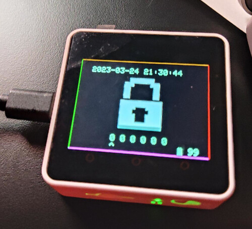
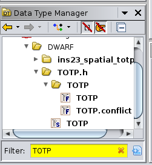
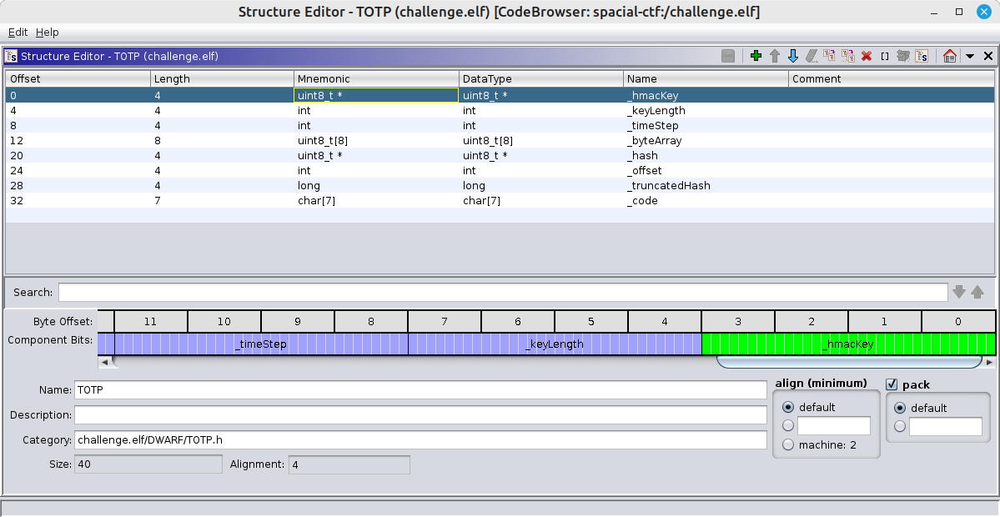
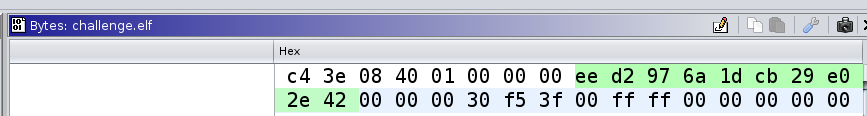
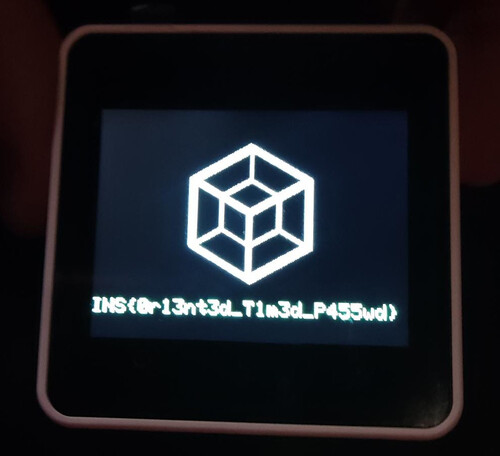

# Spacial TOTP by Cryptax and Phil

This challenge was at [Insomni'hack CTF 2023](https://insomnihack.ch).
The write-up was also published [here](https://cryptax.github.io/ins2023-spacial/).

## Description

"I sealed my master phassphrase on this device and protected it using my own TOTP algorithm. Can you recover it ?

Once ready, come to the organizers desk to validate your solution on the device. (No connection to the device allowed)"

## Solution

I didn't solve this challenge on my own, but with nice team work with another team mate :)

### Overview of the device



The device is a [**M5 Core**](https://m5stack.com) (we used M5 Core Ink at Ph0wn CTF). By turning it to the left/right/up/down, you can enter numbers 0 to 3. The OTP code is a 6-digit code of numbers *between 0 and 3*. If you enter the correct code, you **get the flag**. If not, access is *denied*.

In theory, this is not a very secure password, but as we can't script attempts, it's still too long to bruteforce all 6-digit possibilities.

We could imagine connecting to the serial interface of the device and reading information, or dumping the entire firmware to retrieve the flag, but we are not allowed to connect to the device. The solution needs to come from reversing the `challenge.elf` file which is provided in the description.

### Reversing the Xtensa binary

The ELF file is an Xtensa binary. This is not supported by many decompilers, fortunately my team mate has already setup Ghidra with *Xtensa* support, so we don't have to lose time setting it up.

```
$ file challenge.elf 
challenge.elf: ELF 32-bit LSB executable, Tensilica Xtensa, version 1 (SYSV), statically linked, with debug_info, not stripped
```

In Arduino-like devices, the interesting main entry points are always named `setup()` and `loop()`.

The `setup()` initializes the M5 Core, its screen and RTC. The most interesting part lies in `loop()`.

Get the current timestamp and create a new OTP code based on the timestamp:

```c
  iVar4 = 0;
  memw();
  memw();
  memw();
  timestamp = (time_t)getTimestamp(unaff_a10);
  memw();
  s = TOTP::getCode(&totp,timestamp);
  new_code = atol(s);
  timestamp = timestamp + 3600;
  this = &M5;
```

Tranform the 6-digit OTP code in a 6-digit code using only numbers between 0 and 3:

```c
    memset(input_sequence,0,6);
    setScreenMain();
    lVar1 = new_code;
    code = new_code;
    memw();
    i = 0;
    while (memw(), i < 6) {
      memw();
      memw();
      code_sequence[i] = (byte)(lVar1 >> ((i & 0xf) << 1)) & 3;
      memw();
      memw();
      i = i + 1;
      memw();
      memw();
    }
```

Compare the input sequence with the expected one. Display the ACCESS GRANTED image and the flag (from the EEPROM) if the code is correct:

```c
  if (entry == 6) {
    memw();
    iVar4 = memcmp(input_sequence,code_sequence,6);
    if (iVar4 == 0) {
      memw();
      M5Display::drawJpg(&this->Lcd,access_granted,0x750c,0,0,0,0,0,0,JPEG_DIV_NONE);
      TFT_eSPI::setCursor((TFT_eSPI *)this,0,200);
      do {
        bVar7 = EEPROMClass::read(&EEPROM,iVar4);
        iVar4 = iVar4 + 1;
        Print::printf((Print *)this,&DAT_3f41b32c,(uint)bVar7,0,0,0);
      } while (iVar4 != 0x1c);
```

Once again, if we had been authorized to physically connect to the device, we would have been able to retrieve the flag from the EEPROM. But we're not allowed to, so the solution is 

1. Implement the OTP algorithm 
2. Implement the digit transformation
3. Compile
4. Go to the device, make sure our time is synchronized
5. Run our program and get the correct code
6. Enter it on the device to get the flag.

### OTP implementation

We dig into `TOTP::getCode`:

```c
char * __thiscall TOTP::getCode(TOTP *this,long timeStamp)

{
  char *pcVar1;
  
  pcVar1 = getCodeFromSteps(this,timeStamp / this->_timeStep);
  return pcVar1;
}
```

The functions calls `getCodeFromSteps` with 2 parameters: the TOTP object, and a number of iterations.

If we decompile `getCodeFromSteps`, we see it computes a HMAC-SHA1 over the number of iterations, using a HMAC key.

```c
  this->_byteArray[4] = (uint8_t)((uint)steps >> 0x18);
  iVar4 = 0;
  this->_byteArray[5] = (uint8_t)((uint)steps >> 0x10);
  *(ushort *)(this->_byteArray + 6) = (ushort)(steps << 8) | (ushort)((uint)steps >> 8) & 0xff;
  memw();
  *(undefined4 *)this->_byteArray = 0;
  memw();
  Sha1Class::initHmac(&Sha1,this->_hmacKey,this->_keyLength);
  Print::write(&Sha1.super_Print,this->_byteArray,8);
  puVar6 = Sha1Class::resultHmac(&Sha1);
```  

 Then, there is some logic to truncate the output, but we don't need to look into it now (and actually, we'll see we don't need to look into it at all).

```c
this->_truncatedHash = 0;
iVar2 = 3;
while( true ) {
  uVar3 = this->_truncatedHash << 8;
  iVar5 = (lastHmacByte & 0xf) + iVar4;
  this->_truncatedHash = uVar3;
  iVar4 = iVar4 + 1;
```

### Finding OTP configuration settings

So, it seems important to know 

1. What HMAC key is
2. The number of steps which are used

Both information are part of the TOTP object: we see `this->_hmacKey` in HMAC initialization, and `this->_timeStep` in `getCode()`.

In Ghidra's Data Type manager, we search for the TOTP type.



It opens a structure editor where we see the fields of the object, including `_hMacKey` and `_timeStep`.



A right click on those lists the uses of the fields. We locate the instantiation of the TOTP object:

```c
void _GLOBAL__sub_I_prev_state(void)

{
  TOTP::TOTP(&totp,hmacKey,10,0x3c);
  return;
}
```

This sets the HMAC key in the TOTP object. It's a 10 byte key. And `0x3c` is the number of iterations.

```c
void __thiscall TOTP::TOTP(TOTP *this,uint8_t *hmacKey,int keyLength,int timeStep)

{
  this->_hmacKey = hmacKey;
  this->_keyLength = keyLength;
  this->_timeStep = timeStep;
  memw();
  return;
}
```

To find the value of `hmacKey`, we click on it and go to the bytes view.



So, we now have all configuration settings for TOTP: the HMAC key (10 bytes) and the number of steps (0x3c).

### How not to reinvent the wheel

We were about to reimplement the TOTP algorithm ourselves when we realized it was probably taken from the net. We searched for `getCodeFromSteps` and HMAC and quickly found a C library on [GitHub](https://github.com/Netthaw/TOTP-MCU).

We cloned the library and confirmed it was exactly the code we had. So, no need to reimplement TOTP, we can just use it. Based on the `README`, we created our TOTP solving program:

```c
#include "TOTP.h"
#include <stdio.h>
#include <stdint.h>
#include <stdlib.h>
#include <time.h>

void main(int argc, char **argv) {
  uint8_t hmacKey[] = {0xee, 0xd2, 0x97, 0x6a, 0x1d, 0xcb, 0x29, 0xe0, 0x2e, 0x42};
  time_t current_time;
  TOTP(hmacKey, 10, 0x3c);
  time(&current_time);
  printf("Time=%ld\n", current_time);
  printf("UTC Time=%ld\n", current_time-3600);
  
  uint32_t newCode = getCodeFromTimestamp(current_time-3600);
  printf("New code: %d\n", newCode);

  uint32_t newCode2 = getCodeFromTimestamp(current_time);
  printf("New code UTC: %d\n", newCode2);
```

Then, we added the conversion to 0-3 digits only:

```c  
  int i;
  char pin[7];
  
  for(i=0;i<6;i++) {
    pin[i] = newCode >> (i*2) & 3;
    pin[i]+='0';
  }
  printf("\npin    : %s\n",pin);

  for(i=0;i<6;i++) {
    pin[i] = newCode2 >> (i*2) & 3;
    pin[i]+='0';
  }
  printf("\npin UTC: %s\n",pin);

}
```

Our program finally compiled (see Troubleshooting section for more crunchy details).
We went to the device, checked time synchronization between our laptop and the device (perfect - at most a few seconds difference), waited for the code to change, and then entered it and bingo!



## Troubleshooting

Should talk about how much time we stupidly wasted trying to compile and link this silly program? Be kind with us, it was late, and we actually had to fix the library which was not taking care of multiple re-definitions. We added of couple of:

```c
#ifdef SHA1_IMPLEMENTATION
uint8_t bufferOffset;
uint32_t byteCount;
uint8_t keyBuffer[BLOCK_LENGTH];
uint8_t innerHash[HASH_LENGTH];
...
#else
extern uint8_t bufferOffset;
extern uint32_t byteCount;
extern uint8_t keyBuffer[BLOCK_LENGTH];
extern uint8_t innerHash[HASH_LENGTH];
#endif
```

The other we ran into was the difference between our current local time and UTC time.

In the device's code, you probably noticed `timestamp = timestamp + 3600;`. We saw it too, and deduced that the TOTP code was based on UTC time. As we're 1 hour ahead, we deduced we had to remove 3600 seconds from our timestamps in our own computation of the TOTP code. Unfortunately, the resulting code did not work. We checked our code, we checked the reverse and could not see any mistake, so we decided to also compute a code without removing 3600 seconds - because you know, it's midnight and everybody is tired so maybe we just got it wrong. We did so, and we flagged. But without understanding *why* it worked without those 3600 seconds difference...

## Other write-up

- [https://blog.nanax.fr/post/2023-03-25-spacial-totp/](https://blog.nanax.fr/post/2023-03-25-spacial-totp/)


