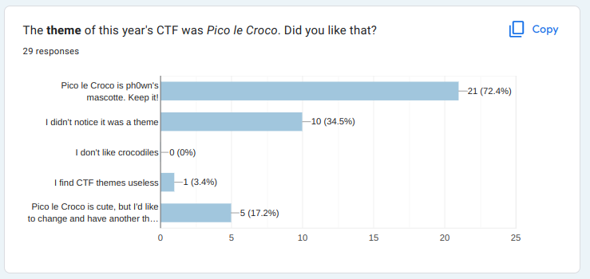

\newpage

# Letters to the Editor

::: columns

## Letter from Mr Robot

> My challenge write-up is even better than yours. How do I contribute?

We welcome external write-ups which are related to Ph0wn topics, i.e IoT, OT, ICS, Smartphones, Satellites, Hardware...

Please send to `contact@ph0wn.org` your write-up as a very simple **Markdown** file, along with all necessary *images*. Do not forget to mention:

- The CTF and the title of the challenge
- The name or nickname you want to appear as
- The date of the write-up

## Letter from CtrlAltDefeat

> I know Florian.

Yes, so do we. We hope you convinced him to come.

## Letter from WhiteHat

> Merci pour l'organisation, on a hâte de venir participer aux workshops et au CTF!

C'est gentil. Nous aussi on avions hâte de vous voir plancher sur les challenges qu'on avait préparés. Quant aux workshops, ils étaient *tellement* bien qu'on y a envoyé en douce quelques organisateurs, parce que, hein, quand même, faut vérifier la qualité, n'est-ce pas ?

## Letter from Ian Toolate

> Bad news, i get the information too late, and it's already full for the Ghidra workshop ... ooh nooo ... we are many interested by this project. Perhaps it's a bit more of organization on your side, but any chance to duplicate this workshop in order to get some additional place for registration ? Thanks for your event, see you there !

The Ghidra workshop was full in 6 minutes. We'd love to have more seats, but it's particularly difficult for workshops which involve devices. And, also, for the teacher, it's different to teach to a class of 10 and to a class of 50.

First thing we'll do is: we're going to be very very kind to the trainer, and hope he accepts to come back next year. Then, perhaps you and your friends can get a seat next year?

## Letter from ByteMaster Jay

> Thank you for such a nice opportunity 

We're glad you like it, and we thank you for this kind remark.

## Letter from Epitech

> Team of 4 students, all from Epitech Nice. Starting Cyber Security and hoping everything will go well ^^

We're really happy to have several teams from *Epitech* each year. 
And yes, everything will go well, we're certain :) Good luck!

## Letter from Anonymous

> Never communication about our compagny

Don't worry: there's no chance we're going to communicate anything as we don't have any proof you are who you claim to be, right? :P Whoever you are, we're happy to have you at the CTF, and wish you a great day!

## Letter from Croco fan

> Je veux des goodies avec PicooooOOOoo ;)

Ah. A fan of *Pico le Croco*. We hope you managed to grab a few stickers?

We use your remark as an opportunity to tell everyone about last year's feedback on Pico le Croco. To Pico's excitement, **most of answers said he was simply part of Ph0wn and should remain Ph0wn's mascot**. 5 among last year's crowd diplomatically said they were bored with Pico (Pico was very cross about that, we hope he didn't show his teeth too much...).

## Letter from Mrs Simple

> biz

We love you too.

## Letter from Phishy Phillis

> Can we subscribe to Ph0wn magazine? How often are you going to publish it?

Frequency depends on how many contributions we receive but we're planning for a yearly issue, at best 2 per year.

## Letter #11 from Chip Hazard

We received this letter, and believe it should be transferred to [Hydrabus](https://hydrabus.com)

>Subject: Request for Hydrabus Product Extension to HydraMini
>
>Dear Hydrabus Team,
>
>I hope this message finds you well. As an enthusiastic participant of Ph0wn CTF and a fervent user of your exceptional Hydrabus tool, I wanted to express my admiration for your innovative product line.
>
>In preparation for the upcoming Ph0wn event, located between Grenoble and Sophia Antipolis, a group of friends and I are excitedly planning our journey. However, the need for a smaller, portable version of the Hydrabus tool has become apparent. It would be a game-changer if we had access to a compact, handheld device let's call it the 'HydraMini.' This would allow us to tinker and prepare en route, resembling the legendary Austin Minis' agility and efficiency.
>Envisioning the potential of a HydraMini, we could travel in style, brimming with anticipation for the challenging exploits awaiting us at Ph0wn. 
>
>Thank you for considering my suggestion. 
>Best regards,
>
>Mr Crypton Farfadet
>Ph0wn Participant

## Letter from Léandre

> Cher-e organisateur-e, ça serait si top-e si les défis-euh, de Ph0wn là, ils pouvaient etre traduits en provençal, là, histoire-e d'y commmprendre un p'tit peu mieux. Comme ça, on pourrait enfin siroter un pastis-e après avoir flaggé pendant que les parisieng ils seraient juste là les cong à essayer de traduire avec Chat-e-GPT-e. Merci, Léandre.

Cher Léandre, merci pour ta suggestion. C'est sur que le Pastis c'est important, et il faut le défendre par rapport à la Chartreuse. Nous allons y réfléchir.

## Second letter from Léandre

> Chèreuh oreuhganisateureuhcong, je n'ai pag pigég votreuh répongseuh écriteuh dang cetteuh langueuh touteuh mocheuh. Tang qu'à faireuh écrivezg en ricaing, cong !

Chèreuh Léangdreuh, nous sommeuh navrég d'avoir utiliség ce sabir tout mocheuh qu'est le frangçaig, et veilleronsg désoreuhmaig à fièreuhmeng défengdreuh les couleureuh provengçaleuhcong.

:::

# Classified Ads

::: columns

Seeking Elite Engineers: Design Pico's 'Elysian Elegance' - An IoT Smart Home System for Luxurious Living. Craft bespoke solutions for a connected mansion, automated with exquisite taste. Contact Pico at `picolecroco@protonmail.com` to share opulence.

---

Ph0wn staff is looking for:

1. Challenges from talented external contributors. Challenges should be related to IoT.
2. Workshops for Ph0wn 2024, if possible from local speakers. Geek themes.
3. Sponsors for Ph0wn 2024. Sponsors get a few reserved seats to workshops, just sayin'...

---

URGENT: Pico le Croco's Rolls Royce Phantom II has decided to play 'pretend vintage' and refused to move, hampering his ingenious plans for Ph0wn 2024 CTF. Seeking expert car sorcerers to revive the royal carriage ASAP! Apply now at `picolecroco@luxurylair.com` to save the day and be honored in the annals of extravagant challenges.

---

**Official Announcement:**

French Administration unveils plans for a new express motorway/tunnel linking Switzerland to expedite Swiss hackers' journey to Ph0wn. This strategic infrastructure initiative aims to facilitate rapid and secure travel for tech-savvy participants. Stay tuned for updates on this collaborative endeavor in enhancing connectivity for the Ph0wn community.

---

**Bulla apostolica Titula Fidei**

In this year of grace Two Thousand and Twenty-Three,

TTool celebrates His Holy Jubilool. In the name of the Holy Clergeool, We, Carditool Primate of the Provinces of Champagne, bid Him, as well as His Holiness the Popool, a Holy and Glorious twentieth anniversary.

May the Holy Clergeool, in this Jubilool Year, proudly carry the TToolic message within Its jurisdiction.

Amenool.
Carditulis-Archepiscopus Zebra,
Primas Provinciarum Campaniae

PS: hic est UROOL: https://ttool.telecom-paris.fr/

:::
