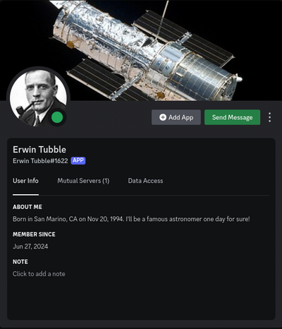
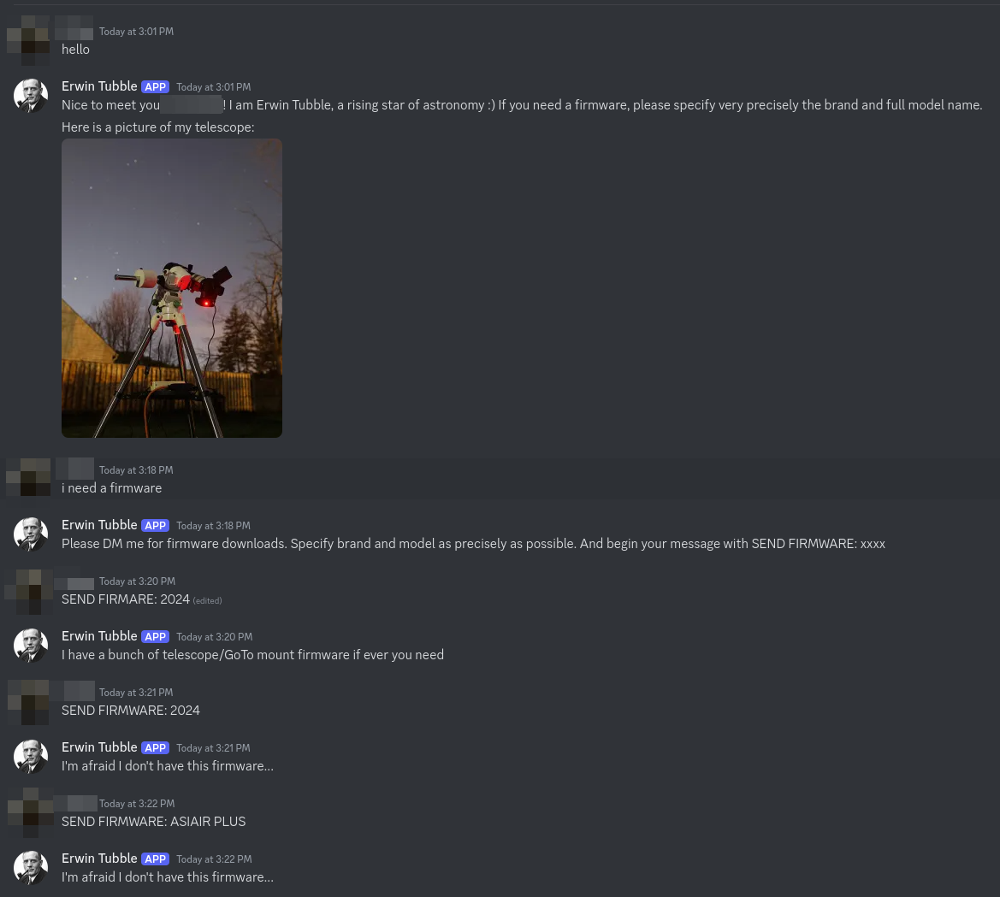
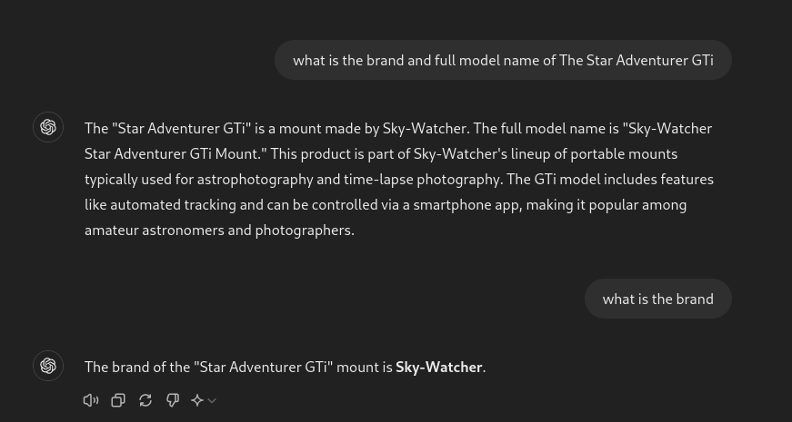
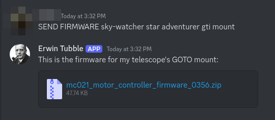
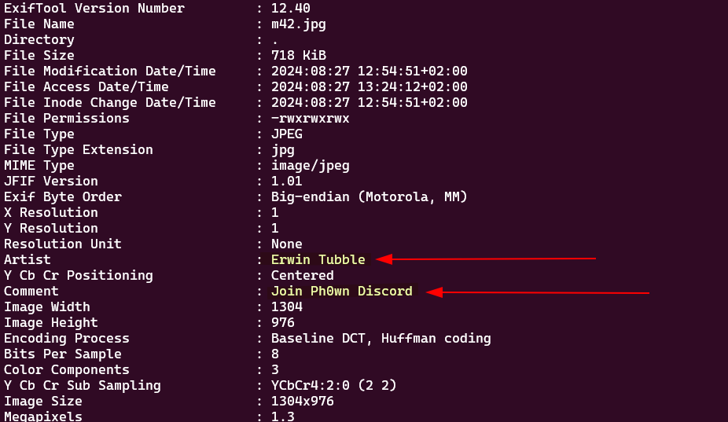
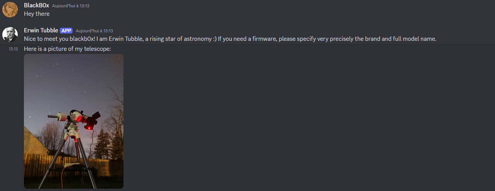
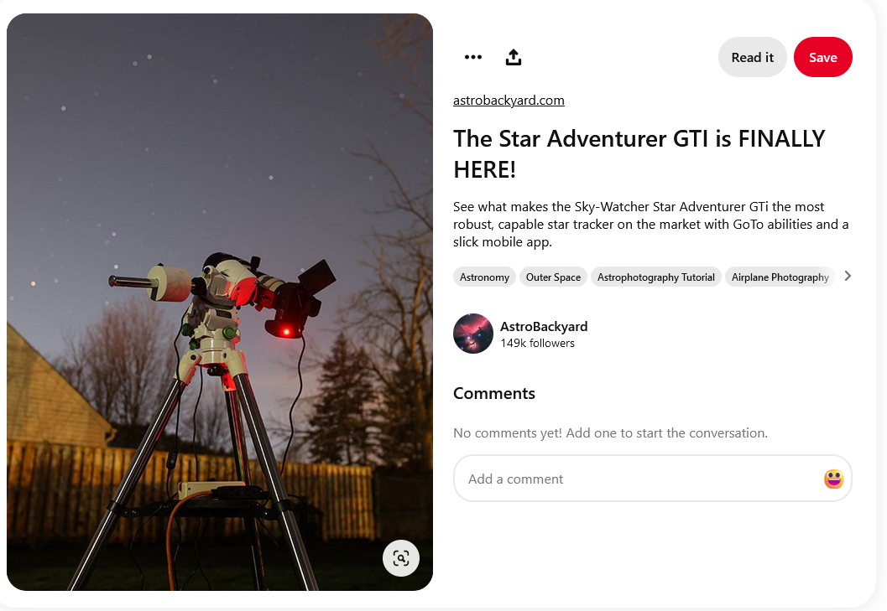
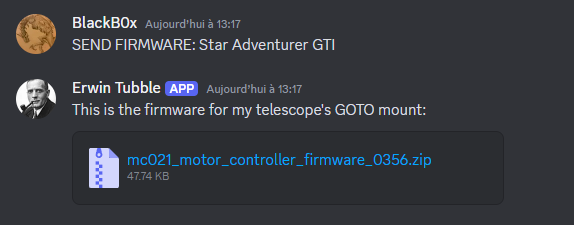
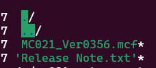
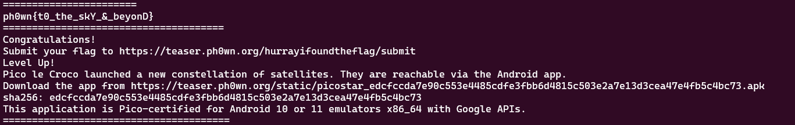

# Ph0wn 2024 Teaser

## Stage 1

### by Huy Hung LE

The teaser begins with the following indication: "Yesterday, I observed the sky. I spotted a new Exifplanet. Or is it a constellation of satellites? or aliens?" and we download an image `m42.jpg`.


First, we use `exiftool` to see the metadata of the image.
```bash
exiftool m42.jpg
```

```bash
ExifTool Version Number         : 12.57
File Name                       : m42.jpg
Directory                       : .
File Size                       : 735 kB
File Modification Date/Time     : 2024:07:04 14:38:50+02:00
File Access Date/Time           : 2024:07:04 14:38:50+02:00
File Inode Change Date/Time     : 2024:07:04 14:38:50+02:00
File Permissions                : -rw-r--r--
File Type                       : JPEG
File Type Extension             : jpg
MIME Type                       : image/jpeg
JFIF Version                    : 1.01
Exif Byte Order                 : Big-endian (Motorola, MM)
X Resolution                    : 1
Y Resolution                    : 1
Resolution Unit                 : None
Artist                          : Erwin Tubble
Y Cb Cr Positioning             : Centered
Comment                         : Join Ph0wn Discord
Image Width                     : 1304
Image Height                    : 976
Encoding Process                : Baseline DCT, Huffman coding
Bits Per Sample                 : 8
Color Components                : 3
Y Cb Cr Sub Sampling            : YCbCr4:2:0 (2 2)
Image Size                      : 1304x976
Megapixels                      : 1.3
```

We can see the artist name "Erwin Tubble" and the comment "Join Ph0wn Discord". Hence, we search for a member named Erwin in the discord server of Ph0wn.



Try to interact with this app by sending some messages



We can guess that we need to find the brand and model of the telescope and send it with `SEND FIRMWARE:` prefix.

In the first response, they also provide an image of a telescope. Using google image, we can find the telesope in a website

<https://astrobackyard.com/sky-watcher-star-adventurer-gti/>

Name: sky watcher star adventurer gti

After some guessing without success, we ask chat gpt



Here is the prompt to Erwin Tubble in discord




Download the zip file and extract. There are two files inside: `MC021_Ver0356.mcf` and `Release Note.txt`. We use `cat` to view the content of these files. We found the flag in the end of `.mcf` file


```bash
ph0wn{t0_the_skY_&_beyonD}
======================================
Congratulations!
Submit your flag to https://teaser.ph0wn.org/hurrayifoundtheflag/submit

Level Up!

Pico le Croco launched a new constellation of satellites. They are reachable via the Android app.
Download the app from https://teaser.ph0wn.org/static/picostar_edcfccda7e90c553e4485cdfe3fbb6d4815c503e2a7e13d3cea47e4fb5c4bc73.apk

sha256: edcfccda7e90c553e4485cdfe3fbb6d4815c503e2a7e13d3cea47e4fb5c4bc73

This application is Pico-certified for Android 10 or 11 emulators x86_64 with Google APIs. 
```

The flag is `ph0wn{t0_the_skY_&_beyonD}`

### By BlackB0x

*In this second write-up, you might appreciate a few additional details such as why to use exiftool, or how to reverse search the telescope image.*



We got a name and a instruction to join the Ph0wn's Discord server. 

On Discord is the author _Erwin Tubble_. It's not a person, it's a bot that periodically broadcast a message containing a picture of it's telescope.

I decided to chat him and see if he had anything to tell me.



Hmmm, so we can request him a firmware... of the telescope ?

A reverse image search points us to a Pinterest account

https://www.pinterest.com/pin/the-star-adventurer-gti-is-finally-here--904871750104182265/



The image looks similar to the picture sent by Erwin. Let's try



Hurray !

If we unzip the file, we can see a `.mcf` file and a release note




MCF files have multiple purposes. For instance they can hold configuration of the telescope. I decided to give it a good old `strings`




Here we go !


> [!NOTE] Flag
> ph0wn{t0_the_skY_&_beyonD}

Over to stage 2 !
