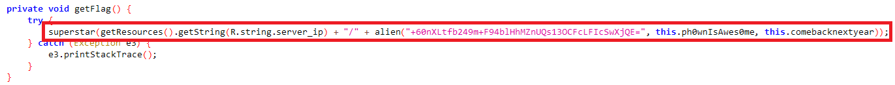
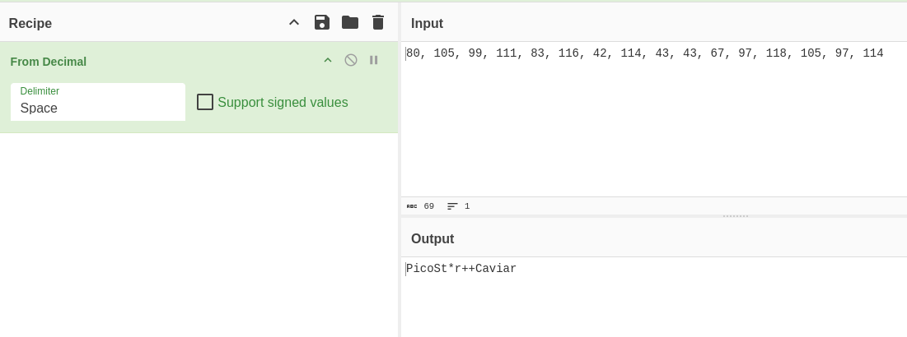
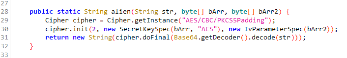
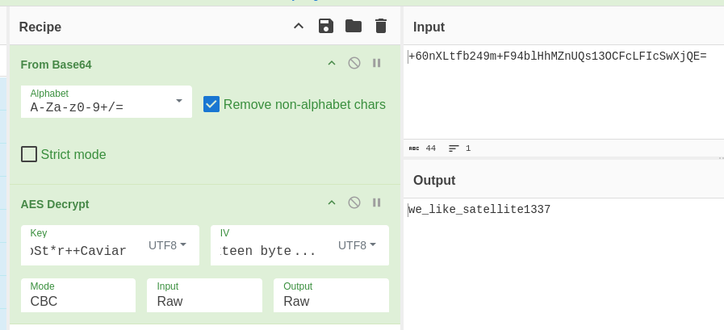
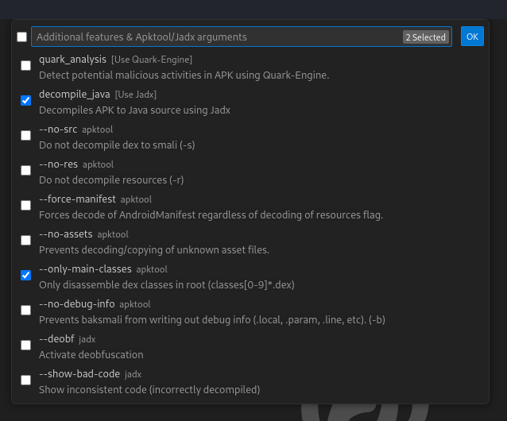
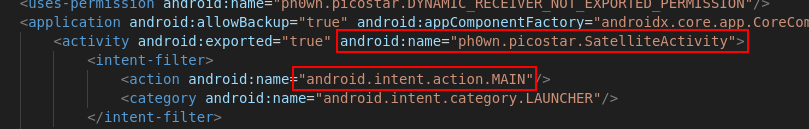
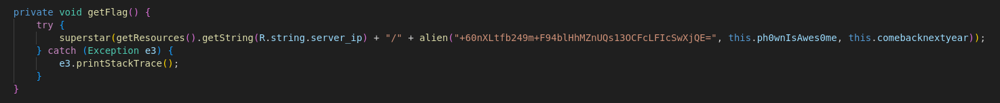
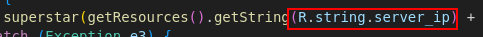
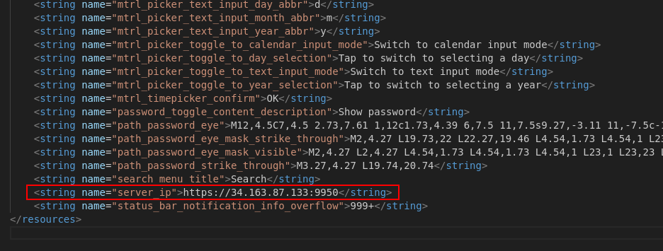
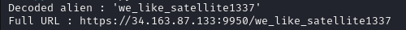

## Stage 2

### by R

The flag for the previous stage (stage 1) leads to an Android package (APK) file. 

The first thing to do while analyzing any APK statically is to look at
the `AndroidManifest.xml` file. I used jadx-gui.
The main activity is `ph0wn.picostar.SatelliteActivity`.
Opening this activity class in jadx-gui reveals 4 functions

```java
    public static String alien(String str, byte[] bArr, byte[] bArr2)
    private void getFlag()
    public final void onCreate(Bundle bundle)
    public final JSONObject superstar(String str)
```

The `getFlag` function contains one instruction:



Both `ph0wnIsAwes0me` and `comebacknextyear` are defined as byte arrays
in the same class. To convert these to UTF8 strings, cyberchef is your
best friend.

After conversion by CyberChef, we get:



```
ph0wnIsAwes0me = "PicoSt*r++Caviar"
comebacknextyear = "Sixteen byte IV!"
```

Following the `alien` function, it accepts three parameters - a base64
encoded string, `ph0wnIsAwes0me` and `comebacknextyear`.



Looking at the function, we can see it is decrypting the base64 decoded
string using AES/CBC with `ph0wnIsAwes0me` as the key and
`comebacknextyear` as IV. This can also be replicated using CyberChef



This reveals the string "we_like_satellite1337".

Going back to the `getFlag` function, the preceding string in
`superstar` argument is `R.string.server_ip`. This value can be found
within the `res/values/strings.xml` file after using `apktool` to
decompile the package. The value revealed is
https://34.163.87.133:9950.

So, finally, the argument to the `superstar` function is
https://34.163.87.133:9950/we_like_satellite1337.  
Visiting this URL reveals the flag and next stage.

```
Congratulations, you validated STAGE 2. Submit your flag to https://teaser.ph0wn.org/hurrayifoundtheflag/submit Flag: ph0wn{theSt4rsSh1neInTh3SkY} === STAGE 3 === With his constellation of satellites, Pico le Croco has managed to contact Aliens. This is their message: "We, inhAbiTantz of Tenda, h4ve patChed ouR b3st r0uter tech. On http://34.155.175.156 We beLi3ve in iT. U donT hav3 n0 sk1LLs to haCk." Pico managed to grab the httpd daemon they use and a pcap. Download both (stage3.tar.gz) from https://teaser.ph0wn.org/673d27d84d17ef194b0dbe4ac02d85a40d75d8e12310cdd538551bef0fecc333 SHA256: 2c989c7116cabd8b57c987e503e85bd625d62421d6e408a6ea839b03d4086b72 httpd 3562fa5c4034ae1fc4219f1e58151cacb5fd9c8b450b28d5e94d5a0782605f06 router.pcapng ================ 
```

### by BlackB0x

*In this second writeup for stage 2, you might appreciate the use of APKLab*.

The stage 2 text have us download an APK. 

```
Pico le Croco launched a new constellation of satellites. They are reachable via the Android app.
Download the app from https://teaser.ph0wn.org/static/picostar_edcfccda7e90c553e4485cdfe3fbb6d4815c503e2a7e13d3cea47e4fb5c4bc73.apk

sha256: edcfccda7e90c553e4485cdfe3fbb6d4815c503e2a7e13d3cea47e4fb5c4bc73

This application is Pico-certified for Android 10 or 11 emulators x86_64 with Google APIs.
```

This is an APK, so let's unpack it using `apktool`.

```
apktool d picostar_edcfccda7e90c553e4485cdfe3fbb6d4815c503e2a7e13d3cea47e4fb5c4bc73.apk
```

Now we can start the static analysis of this. Visual Studio Code (or, its open source equivalent : VSCodium) has an extension called [APKLab](https://github.com/APKLab/APKLab), designed to reverse engineer APK files.

Once the requirements are satisfied we can import the APK in VSCodium. I went with the options `decompile_java` and `--only-main-classes` options.



A new window will open with the decompiled APK. Now we can start hunting for the main code.
Let's head to the Android Manifest and check for the main activity.




The main activity is in `SatelliteActivity`. Opening it directly shows a `getFlag` function. Probably a good lead :).




Two function are called,
- `alien`, which decrypts a decoded Base64 buffer passed as parameter, using AES-CBC.
- `superstar` which performs an HTTP connection to a remote server.

The strange thing is that this function is not called anywhere in the file. I decided to go for the low-hanging fruit anyway and reverse the function.

The server IP is contained in the resources section `R.string.server_ip`





Then it's a matter of decrypting the text. A quick python script will do the trick

```python
from Crypto.Cipher import AES
import base64

def alien(encoded_str, key, iv):
    decoded_bytes = base64.b64decode(encoded_str)
    cipher = AES.new(key, AES.MODE_CBC, iv)
    decrypted_bytes = cipher.decrypt(decoded_bytes)
    return decrypted_bytes.decode('utf-8')

server_ip = "https://34.163.87.133:9950"
key = bytes([80, 105, 99, 111, 83, 116, 42, 114, 43, 43, 67, 97, 118, 105, 97, 114])
iv = bytes([83, 105, 120, 116, 101, 101, 110, 32, 98, 121, 116, 101, 32, 73, 86, 33])
encoded_str = "+60nXLtfb249m+F94blHhMZnUQs13OCFcLFIcSwXjQE="

print(f"Decoded alien : '{alien(encoded_str, key, iv).strip()}'")

print(f"Full URL : {server_ip + '/' + alien(encoded_str, key, iv).strip()}")
```



A nice URL. Let's try to reach it 

```
Congratulations, you validated STAGE 2.
Submit your flag to https://teaser.ph0wn.org/hurrayifoundtheflag/submit
Flag: ph0wn{theSt4rsSh1neInTh3SkY}
```

Flag 2 : Check ! Onto stage 3 !
