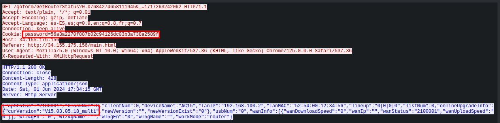

## Stage 3

### by ghozt

For this step, Pico helps us a lot: 

```
=== STAGE 3 === 
With his constellation of satellites, Pico le Croco has managed to contact Aliens. This is their message: "We, inhAbiTantz of Tenda, h4ve patChed ouR b3st r0uter tech. On http://34.155.175.156 We beLi3ve in iT. U donT hav3 n0 sk1LLs to haCk." Pico managed to grab the httpd daemon they use and a pcap. Download both (stage3.tar.gz) from https://teaser.ph0wn.org/673d27d84d17ef194b0dbe4ac02d85a40d75d8e12310cdd538551bef0fecc333 SHA256: 2c989c7116cabd8b57c987e503e85bd625d62421d6e408a6ea839b03d4086b72 httpd 3562fa5c4034ae1fc4219f1e58151cacb5fd9c8b450b28d5e94d5a0782605f06 router.pcapng ================
```

We download the two provided files:


We can access to the given [IP](http://34.155.175.156), the web application seems to be a Tenda switch authentication form:


#### Pcap capture file

This capture contains mainly clear text HTTP network traffic:


The internal IPs corresponds to the targeted router. I also notice some traffic to a md5 rainbow table website (http://reversemd5.com)


HTTP requets to this websites does not reveal any password.

By analysing frames corresponding to the switch application, I can identify a session cookie in some requests:



This frames also gives us the switch version (V15.03.05.18_multi).
This version seems to be vulnerable to command injection, buffer overflow, ...
But all this exploits needs to be run post authentication.

The "password" cookie does not seems to be an md5 (19 bytes). Thus, the link between this cookie and the reversemd5 website is not very clear to me at this moment :D

I can also observe that a query to /flag is performed, but redirected to the login screen, suggesting that the cookie has expired.


When in doubt, I still try to inject it into my browser, without success.


#### httpd ELF

Let's analyse the given binary:


So this file is an  ELF-ARMv7 web server binary. My first thought was to identify is the known CVE are patched or not. This is not the case. However, I still need an authenticated access to exploit theses CVE...

Let's focus on an interessting function called ```R7WebsSecurityHandler```.
This function seems to be responsible of the authenticated state, or at least the session management. I can see acces to the form POST variables (username and password), as well as the password hash comparison. According to the pcap file, at this moment, my supposition is that the password is stored as MD5.

Javascript files and the website behavior helps me understand that the password is ssend to the server as MD5, with hashing operations done client side on the application as seeen in the capture and in the JavaScript files:


By searching for the string "password=", I can quickly identify the code responsible for the cookie generation.

```C
int32_t res
if (client == 0xffffffd0)
    res = strcpy(&cookie, g_Pass)
else
    res = sprintf(&cookie, "%s%s%s", expired_cookie_option + (atoi(strrchr(client + 0x30, 0x2e) + 1) << 2), g_Pass, cookie_suffix + ((inet_addr(client + 0x30) % 0x50) << 2))
if (authOK == 1)  // password OK
    res = client_write(client, "Set-Cookie: password=%s; path=/\r…", &cookie)
else if (authOK == 0)  // password OK
    res = client_write(client, "Set-Cookie: password=%s; path=/\r…", "errorlogin")
if (RedirectLocation != 0)
    res = client_write(client, "Location: %s\r\n", RedirectLocation)
client_write(client, &data_dc5a4, res)
if ((*(client + 0xd8) & 0x200) == 0 && arg3 != 0 && zx.d(*arg3) != 0)
    client_write(client, "%s\r\n", arg3)
return EndWithHTTPCode(client, HTTPCode)
```

The line 5 helps to understand how the cookie if forged:

 - "expired_cookie_option" (based on an array offset)
 - MD5 of the password
 - "cookie_suffix" (based on an array offset)

Let's identify what expired_cookie_option and "cookie_suffix" corresponds to.

Cookie suffix seems to be a array of constant values:


This table is accessed based on an IP (use of inet_addr) and the offset seems to be the last IP part as integer.

However, the value seen in the pcap file is not present in this table. But remember, aliens have patch the binary...

Let's have a look to the expired_cookie_option now. Looking at the cross references to this variable, I can identify a piece of code doing some random generation in the R7WebsSecurityHandler function:


Reversing this code, I understand that the expired_cookie_option is nothing more than three lowercase characters generated "randomly"... Indeed, a random number is generated, but then % 26 + 'a' is applied on this random, resulting in a lowercase character.

As the seed used in srand(3) is the current time, my first tries consits in crafting valid session cookie. But, in the same way as for the suffix, the cookie in the pcap file does not begin with lowecase characters...

At this point, I know how to craft cookies, but i miss some constants that seems to have been modified.. hum.

I decide to download an official firmware and use bindiff to see if any vulnerabilities or hardcoded values have been induced. But while building some Binary Ninja plugins to export dissassembled code to bindiff format, I kept thinking to this cookie... 

Wait, now I know more about the cookie:
 - expired_cookie_option --> 3 lowercase characters
 - MD5
 - cookie_suffix --> 3 lowercase characters

So I can just retrieve the MD5 hash of the password among the cookie data !!!

Using the same website (reversemd5.com) as seen in the network capture, boum password can be recovered `\o/`


Once authenticated, I can access the /flag page as seen in the pcap :)


Then just grab the flag:

```bash
ghozt@maze:~$ echo -ne 'Dut!fulS0up' | sha256sum
b21abc907ad4742969a9970e36ecc8efa995f1720270090a3c7184abacd65061  -
```


Thanks to the organizers for this nice challenge :)

### By BlackB0x

*This write-up provides an alternate solution to stage 3, using Qiling*.

We have a pcapng file as well as a binary. Given the message this is an HTTP server. Let's go to the mentioned IP address to see what what happens.


We are greeted by a login page. Stands to reason that we need the password to get the last flag. It's time to have a look at the pcapng.

What I like to do first when first analyzing an unknown pcap is having a look at the statistics, so I can get an overview of what is happening in the pcap. Let's head over to `Statistics > Protocol Hierarchy`


The traffic is mostly HTTP. Cool, that will be easier to understand. Let's see in the conversation what are the IP addresses involved in the traffic.


3 IP addresses of which 2 are local IP addresses. It's safe to assume that `192.168.1.7` is a workstation and `192.168.1.1` is the router.

If we apply the `http.request.method` we'll see the requests emitted by the client.


So we have a `flag` page that probably contains our flag. 

If we follow one of the TCP stream we can see the HTTP header sent. There is an interesting header 


Additionally, the address `54.247.175.238` is the website `reversemd5.com`.


This is probably an indication that we'll have to reverse an MD5 hash to get the password. However, the length of the cookie is 38 character. An MD5 hash is 32 character long. There are some garbage that we need to remove.

Finally, this binary is an ARM binary. 


This challenge can be solved with static analysis, but I wanted to try to solve it through dynamic analysis with the [Qiling Framework](https://github.com/qilingframework/qiling) .

#### Environment setup 

##### Qiling installation

Qiling is a Python framework enabling cross-platform binary execution. It also provides a nice API to perform memory and register operations, hook addresses, function, Syscalls, and many other features.

A complete installation guide is available here https://docs.qiling.io/en/latest/install/. Installation in a Python virtual environment is recommended.

##### Router rootfs

Since this binary is a dynamically linked library, Qiling will need the shared library to execute the program. I decided to try to get the rootfs directly.

Looking through the shared library in the binary, I spotted a library `libCfm.so`. The other libraries are fairly known, but I had a hunch that this one was custom made by the vendor


I decided to google the company name and the name of this library


Interesting, someone published a rootfs on Github. It also gives the complete model of the router : AC15.

I downloaded the rootfs and decided to try it. I downloaded the `.bin` file from the Github repo and then extracted the rootfs through `binwalk`. The rootfs is located in `./US_AC15V1.0BR_V15.03.05.18_multi_TD01/squashfs-root`. I then copied the `httpd` binary under `/bin`. This step is not really necessary but I did it nonetheless.

#### Httpd emulation

I started with a basic emulation with the following python script.

```python
from qiling import *
from qiling.const import QL_VERBOSE, QL_INTERCEPT

root_fs_path =  "US_AC15V1.0BR_V15.03.05.18_multi_TD01/squashfs-root"

def T15_sandbox(path, rootfs):
    ql = Qiling(path, rootfs, verbose=QL_VERBOSE.DEBUG)

if __name__ == '__main__':
	T15_sandbox(["./US_AC15V1.0BR_V15.03.05.18_multi_TD01/squashfs-root/bin/httpd"], root_fs_path)

```

When trying to execute a binary with Qiling for the first time, I always use the `QL_VERBOSE.DEBUG` flag to have an overview of what's happening and within the Python Qiling virtual environment I tried the script. 
The execution stopped quickly so I had to peruse the debug log to find out what was wrong.


The binary is trying to connect to a socket located at `/var/cfm_socket` but cannot find it.

Qiling provides a few [examples](https://docs.qiling.io/en/latest/demo/) on how binaries can be emulated for difference platforms. Among them is one that contains a reference to this socket


There is a piece of code that acts as a server listening on `/var/cfm_socket` in the rootfs. Apparently, the server uses this socket to query configuration. 

I took the code as a base. Additionally, the server is looking for a bridge interface to bind to. The easiest way to do this I created an interface `br0` and assigned it to network `192.168.24.0/24`. 
I also needed to create a specific Linux profile for Qiling. I copied the original `linux.ql` profile under `qiling/profiles`. I then replaced the interface under `ifrname_override` with `br0`. This file will be passed as a parameter to the `Qiling` class.


Hooray ! The sandbox is not crashing anymore ! Since Qiling is in debug mode, we can see the non-blocking `select` being called. 

Qiling binds the socket to `127.0.0.1` port `8080`. Let's try to access it


We can access the UI ! Now, how is the `password` cookie created ?

#### Password were are you ?

We now need to find where and how the password cookie is being handled. Let's fire Radare2 and find it.

the `aaaa` command tells radare2 to perform an extensive analysis. 


Now i'm gonna try to find string containing password. I'll use Radare's `iz` command and filter with the string `password`. The `+` modifier tells Radare2 to perform a case-insensitive search


I also searched for any mention of `cookie`, as the MD5 is contained in a HTTP cookie. I found the following


This is a confirmation that there is at least a suffix on the cookie.

I started to search references to some interesting strings above, using radare's `axt` command and the virtual addresses of the strings (the third column). The function referencing `password=` bears an interesting name


This function is also referencing the `expired_cookie` option


If we print the disassembly after the address of `cookie_suffix`, we can see a call to `sprintf`, as well as a reference to a `g_Pass` symbol.


The cookie is probably generated by this `sprintf` call.

Having a running router is great but, as shown above, we are not landing on an authentication portal, but directly to the administration page. Hence, no password cookie is present in the headers.


I needed to find a way to have the server put the password cookie.

On the router UI, in `System Settings` , there is a `Login Password` button. Likely to change the password. I tried to put a password with a predefined pattern to ease the memory search


Since the password is MD5-hashed, I will have only to search for the pattern in memory.
Sure enough, the MD5 hashed pattern is sent through.


And the next requests contains the password cookie


Now I can try to find how the password is built. I decided to try to hook the address just after where  `sprintf` is called - namely `0x0002f9a4` - and check the content of the parameter.

For some reason, Radare2 was unable to find the content of the format string passed to `sprintf`. Not a problem, this parameter is passed in the `r1` parameter, let's try that with the following code:

```python
def hook_sprintf(ql: Qiling) -> None:
    format = ql.mem.read(ql.arch.regs.read('r1'), 32)

    print(f"format string: '{format}'")
[...]
ql = Qiling(path, rootfs, verbose=QL_VERBOSE.OFF, profile='./linux.ql')

ql.add_fs_mapper("/dev/urandom", "/dev/urandom")
ql.hook_address(hook_sprintf, 0x0002f9a0)

ql.run()
```


The format string is `%s%s%s` 

This is the final python script

```python
import sys, os, socket, argparse
from qiling import *
from qiling.const import QL_VERBOSE, QL_INTERCEPT

root_fs_path =  "US_AC15V1.0BR_V15.03.05.18_multi_TD01/squashfs-root"

cfm_socket_path = os.path.join(root_fs_path, "var", "cfm_socket")
httpd_pid_file_path = os.path.join(root_fs_path, "etc", "httpd.pid")

log_prefix = "[++++++++]"


def nvram_listener():
    data = b""

    print(f"{log_prefix} Unlinking previous socket")
    try:
        os.unlink(cfm_socket_path)
    except OSError:
        if os.path.exists(cfm_socket_path):
            raise

    print(f"{log_prefix} Creating socket at {cfm_socket_path}")
    sock = socket.socket(family=socket.AF_UNIX, type=socket.SOCK_STREAM)
    sock.bind(cfm_socket_path)
    sock.listen(1)

    print(f"{log_prefix} Start listening on socket")
    while True:
        try:
            connection, client_address = sock.accept()
            try:
                while True:
                    data += connection.recv(1024)

                    print(f"--DATA RECEIVED-- {data[0:32]}")

                    if b"lan.webiplansslen" in data:
                        connection.send(b'192.168.24.0')
                    elif b"wan_ifname" in data:
                        connection.send(b'br0')
                    elif b"wan_ifnames" in data:
                        connection.send(b'br0')
                    elif b"wan0_ifname" in data:
                        connection.send(b'br0')
                    elif b"wan0_ifnames" in data:
                        connection.send(b'br0')
                    elif b"sys.workmode" in data:
                        connection.send(b'bridge')
                    elif b"wan1.ip" in data:
                        connection.send(b'1.1.1.1')
                    else:
                        break
                    data = b""
            except ConnectionResetError as e:
                print(f"{log_prefix} Connection Reset Error")
            except BrokenPipeError as e:    
                print(f"{log_prefix} Broken Pipe error received")
            finally:
                connection.close()
        except KeyboardInterrupt as e:
            print(f"{log_prefix} Received keyboard interrupt.")
            break


def hook_sprintf(ql: Qiling) -> None:
    format_str = ql.mem.read(ql.arch.regs.read('r1'), 8).split(b'\x00')[0]

    if format == b'%s%s%s':
        format_str = ql.mem.read(ql.arch.regs.read('r2'), 38).split(b'\x00')[0]
        arg_2 = ql.mem.read(ql.arch.regs.read('r3'), 38).split(b'\x00')[0]
        arg_3 = ql.mem.read(ql.arch.regs.read('sp'), 38)

        print(f"Format string: '{format_str.decode()}'\nArg1:'{arg_1.decode()}'\nArg2: '{arg_2.decode()}'\nArg3: '{str(arg_3)}'\n----------")


def T15_sandbox(path, rootfs):
    ql = Qiling(path, rootfs, verbose=QL_VERBOSE.OFF, profile='./linux.ql')

    ql.add_fs_mapper("/dev/urandom", "/dev/urandom")

    ql.hook_address(hook_sprintf, 0x0002f9a0)
    ql.os.stderr = None

    ql.run()


## - Main
if __name__ == '__main__':
    parser = argparse.ArgumentParser()

    parser.add_argument("--nvram", action="store_true")
    parser.add_argument("--router", action="store_true")

    args = parser.parse_args()

    if args.nvram:
        nvram_listener()
    if args.router:
        print(f"{log_prefix} Removing pid file")
        try:
            os.unlink(httpd_pid_file_path)
        except FileNotFoundError as e:
            pass
        T15_sandbox(["./US_AC15V1.0BR_V15.03.05.18_multi_TD01/squashfs-root/bin/httpd"], root_fs_path)

```

Executing the scripts and reading `r1`, we can see the string `fdg` following string is being added as a prefix, and matches the first 3 characters in the cookie returned by the server.


The password MD5 is not present in the string. Not sure why, but at this point, I decided to remove the leading and trailing 3 characters of the cookie. This leaves us with the following MD5

```
3a2270f887b02c94126dc03b3a738a25
```

Let's try to reverse it


We have the password ! In the `pcapng`, the client access the page `/flag`. This page contains the following text:


```
You HumAnZ th0ughT U'd get ouR fl4g so eaSy?.The c0rrect pAg3 is flag_<SHA256-PASSWORD>.
```

Ok, let's get the SHA-256 of `Dut!fulS0up`, which is `b21abc907ad4742969a9970e36ecc8efa995f1720270090a3c7184abacd65061`


Yaaaay ! We found the last flag !
