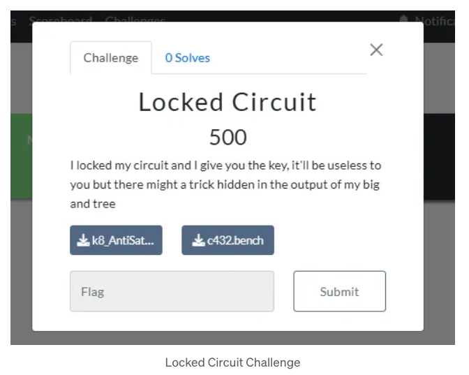
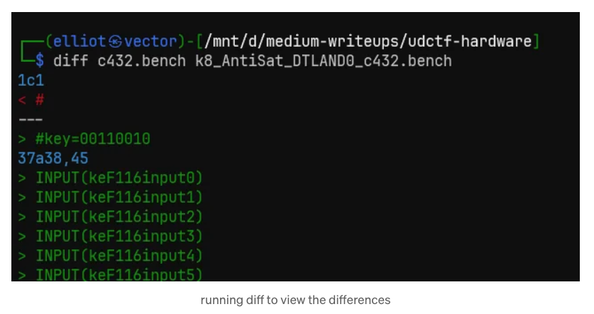
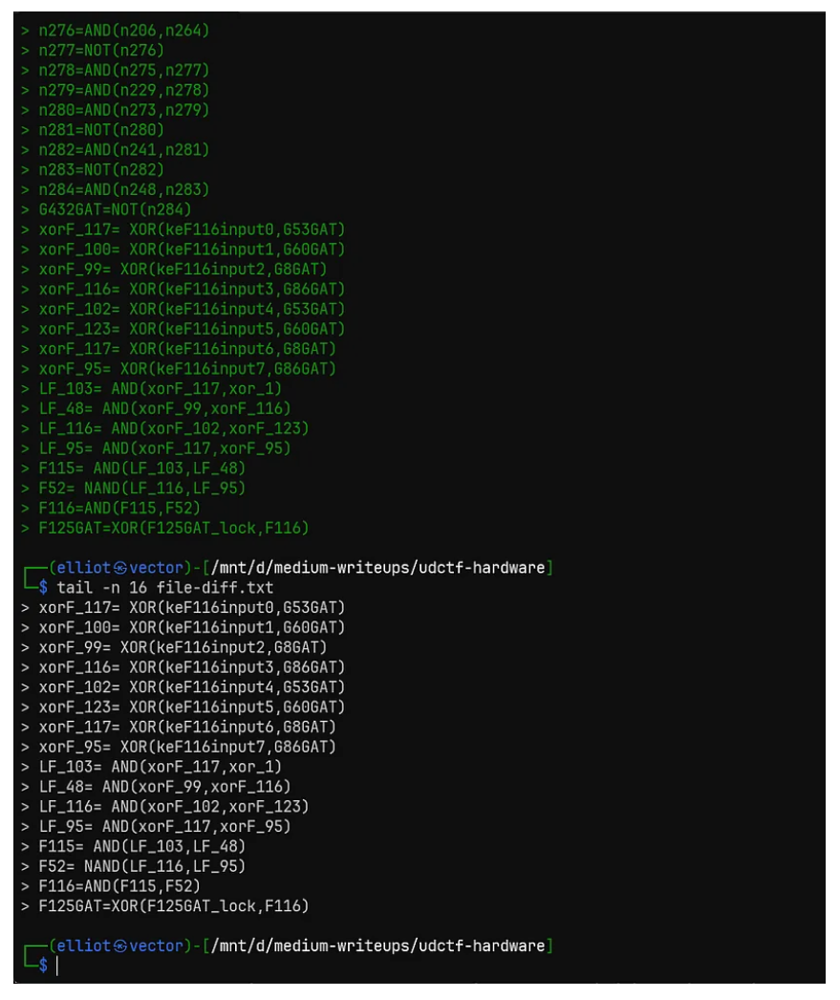
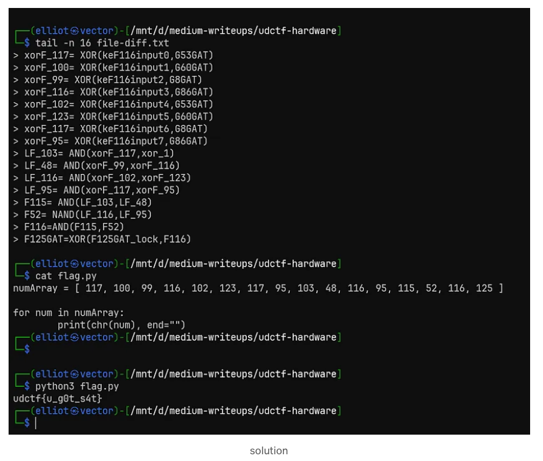

# Blue Hens UDCTF-2023 Hardware Challenge
## Locked Circuit Writeup - Author : robinx0 [Irfanul Montasir]

Two files were provided called “k8_AntiSat_DTLAND0_c432.bench” and “c432.bench” respectively.

As it was categorized as a “Hardware” challenge and when I view the file contents using cat file_name.bench`, at first I thought that I might need a logic gate simulator but turns out I didn’t need it. [I even tried some simulator with the given files but no luck on making them work.]

When I ran diff file1.bench file2.bench` I got some interesting output.

“xorF_117”, “xorF_100” and so on , these (117,100, …) looked like some decimal values that can be converted to ascii. So I wrote a small python script to convert them and voila there’s the flag.

Have a good day!

> This writeup was originally posted on the author's blog on https://robinx0.medium.com/bluehens-udctf-2023-writeup-part-1-hardware-challenge-40ad79505c3a.
