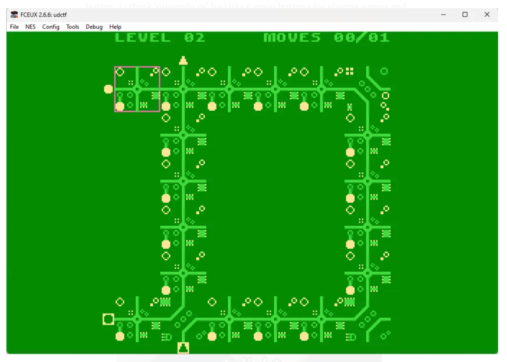

## ElectroNes Writeup - Author : robinx0 [Irfanul Montasir]

This challenge is very interesting for me because I actually never dabbled with nes game before in a ctf competition. So I learned some new things while solving this.

a custom made nes game was provided in the challenge.

To play and debug a nes(nintendo es) game I will use a emulator called fceux. You can download it from here.

Open the nes file in the fceux emulator. Its a puzzle game.

Short Note : How to play the game?

Well, use the arrow keys to go up down left right, and in my pc, ‘A’ and ‘D’ was the button for changing the circuits and ‘enter’ worked as the start button. [ i think ‘nintendo es’ had like 6 main buttons for playing games and two button for select and start.]. In the fceux, emulation speed can be increase or decrease using ‘=’ and ‘-’ respectively.

{ width=50% }

If we look carefully we can see that every circuit design from level 1–6 looks like some alphabet which are “UDCTF{”, this looks like part of the flag! Noice!

Now, after completing level 6 normally we can see a new window like below

{ width=50% }

{ width=50% }

So, we are locked from accessing the rest of the levels normally. So, we need to bypass this. Fortunately ‘fceux’ comes with a hex editor.

We can edit the level counts and just note down the alphabets. Simple, right?

(if you have 0 experience working with hex editor this might be a little bit confusing and might take a little more time for you understand, maybe.) 

So hit ctrl + rto reset the game. Now, open the Hex editor from the debug menu and in the 2nd row, look at these three values.(open it in new tab for a better view)

if we change a circuit like below we can see that the two of the highlighted values changes —

so after some tinkering with the values, I found that in these highlighted values, first one is for the level so we are in level 2 now, so for that hex is 0x01 [for level one, it’s 0x00], and 2nd value is for the default moves limit(moves 00/01) which is 1 always, third one is for how many moves you played(moves 00/01) and the below one is for the circuit choices.

Now that we figured out the hex value for the level count we can hit the reset button( ctrl + r) and now the level count value is 00 in the hex editor.

Now change the value to any level (use a dec to hex converter if needed) and note down the letters.

the last level is ‘23’ (hex is 0x16 ) , remember the hex values are 1 less than the normal hex value, works like an array index system.

Unlock the levels one by one and get the flag. [there is no level 7, which is first letter of the flag ’n’, its easy to guess. ]

flag is — `UDCTF{nes_FLAg_OH_SNAP}`

I hope you learned something new. Have a good day!
