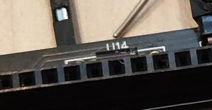
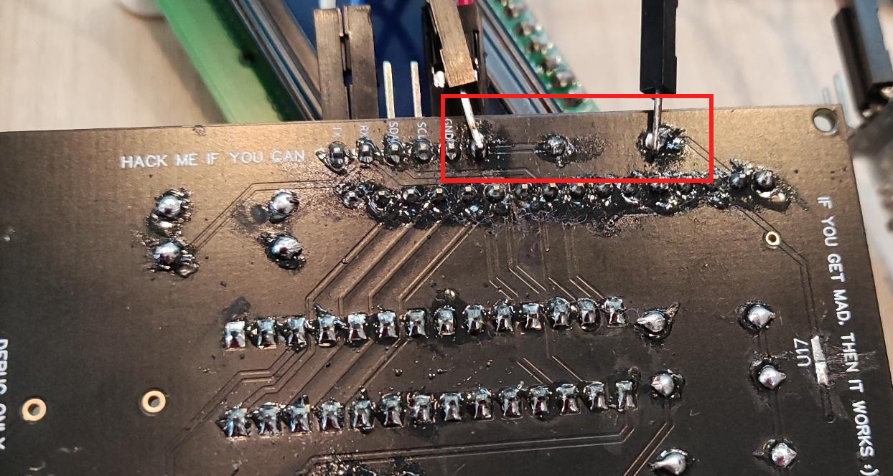
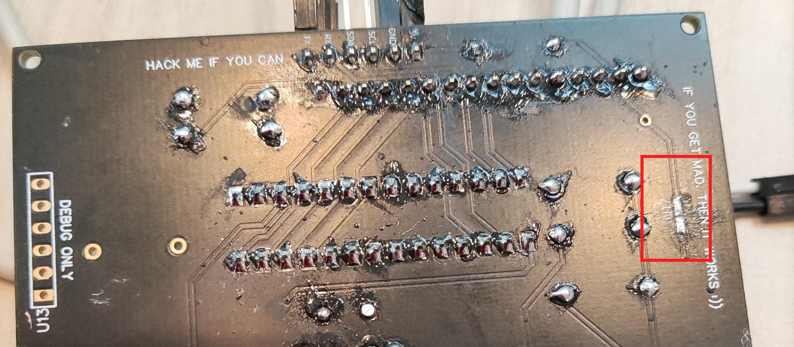
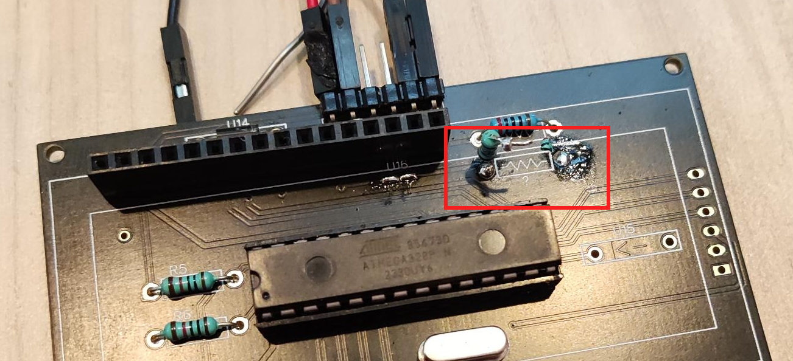
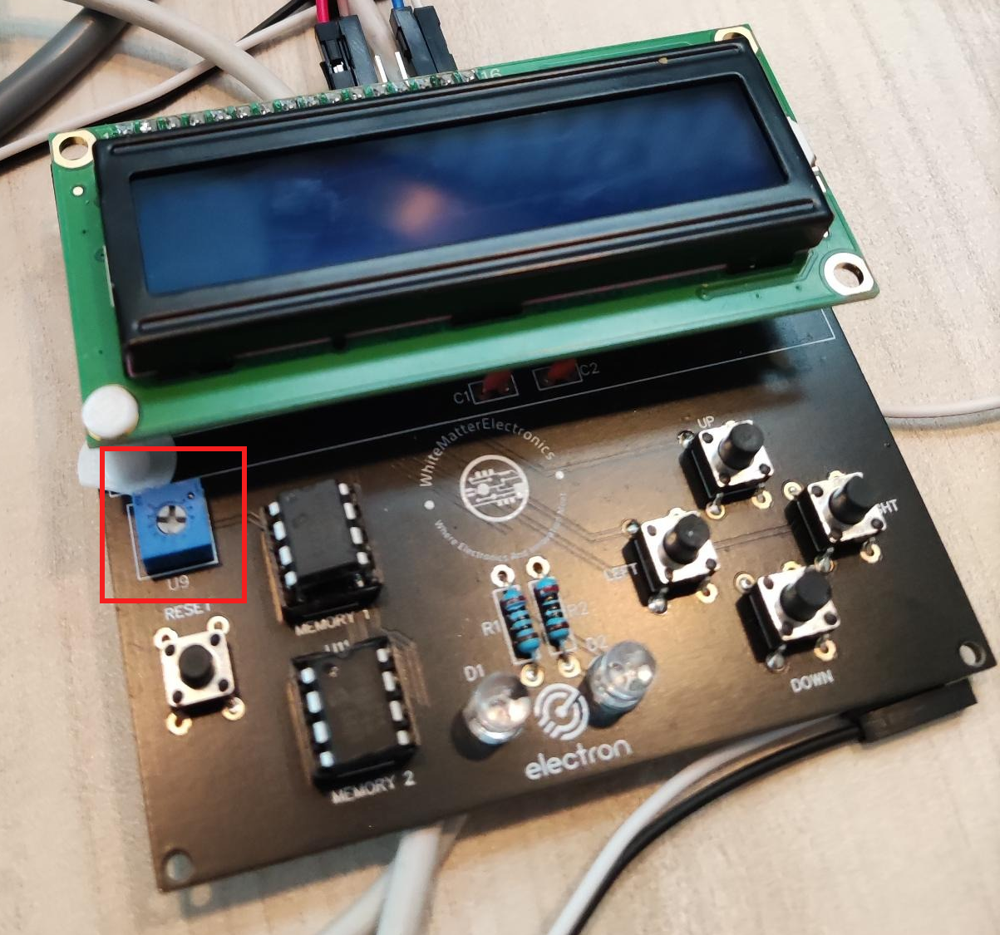
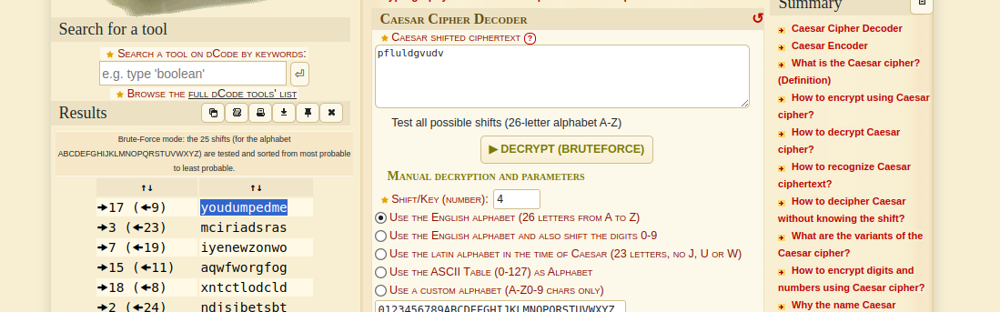
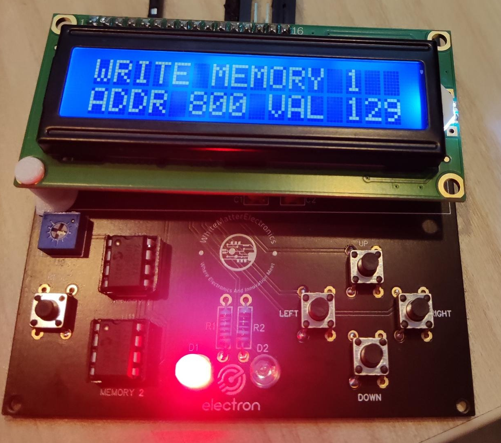
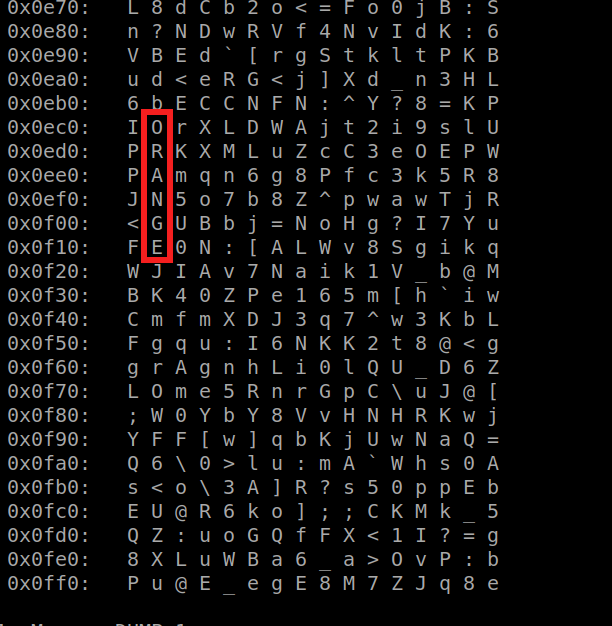

# Nullcon Berlin CTF 2024 - HackMe Hardware Challenges by Cryptax

The 6 challenges below use the same PCB.

## HackMe Fix the Board (5 solves)

The PCB we are given does not work as such: the screen does not light up and the device does not boot correctly. We've got to repair it.

### Fix 1

As the screen does not light up, there has to be a power issue. From VCC, we notice there is a Diode, U14, which is in the wrong direction, thus blocking current.




We let the current pass by simply bypassing the diode. I solder a wire from VCC to the other end of U14.




### Fix 2

We notice that the track by U17 has been (intentionally) cut by the organizers ;)
We just need to solder that again.




### Fix 3

The same also occurs on a track below the screen: intentionally cut, you just need to add solder. It shows on the photo below (Fix 4 - U15 if I read correctly), just left of the resistor.

### Fix 4

A resistor was marked `?` and needed to be removed. I didn't have any scissors, so I did it the caveman-way: heated up one end of the soldering while pushing with a screwdriver from beneath to get the resistor out of its socket. Fortunately, an organizer gave me a hand, because my procedure wasn't very safe...




### Flag

Once all those fixes are done, you can power the device using a USB-TTL, and the screen lights up :) You might also have to turn a potentiometer to see the message which gives you the first flag `LCD`.



The screen shows several menus, each one consisting in the next challenges to unlock.

> I enjoyed this challenge because I'm a n00b at hardware and it wasn't too difficult. For an even more enjoyable experience, I would recommend having a fixed flag format (`LCD` does not look like a flag...) + adding more logic to why we absolutely need to fix the broken tracks and remove the resistor.

## HackMe Dump the memory (3 solves)

The next 2 challenges consist in dumping the 2 EEPROMs labeled "MEMORY 1" and "MEMORY 2".

I follow the beginning of this [tutorial](https://www.youtube.com/watch?v=M4-1FqxVJjw) for the wiring, but actually it's quite simple: VCC goes to 5V, SDA goes to A4 and SCL goes to A5. The rest goes to the ground.

The, I use [the code of this blog post to read an I2C memory](http://chrisgreenley.com/projects/eeprom-dumping/). I just modify the output to break lines every x characters.

Compile the Arduino sketch using "ATmega328P Old bootloader". This information was given by the organizers (when I failed to upload my sketch with the standard bootloader).

```c
#include <Wire.h>
#include <stdint.h>
#define CHIP_ADDR 0x50
// http://chrisgreenley.com/projects/eeprom-dumping/
//  SDA is A4 and SCL is A5
void setup() {
  uint8_t dataAddr;
  Serial.begin(9600);
  Serial.println("Setting up serial");
  Wire.begin();
  //Wire.setClock(31000L); //31 kHz
  Wire.beginTransmission(CHIP_ADDR);
  Serial.println("Begin transmission");
  Wire.write(0x00); //Sets the start address for use in the upcoming reads
  Wire.endTransmission();
  
  for (int chipAddr=0; chipAddr<4096; chipAddr++) { 
    for(uint8_t i=0;i<8;++i){ //cycle through enough times to capture entire EEPROM
      Wire.requestFrom(CHIP_ADDR,32,1); //read 32 bytes at a time
      uint8_t counter = 0;
      while (Wire.available()){
        uint8_t c = Wire.read();
        Serial.write(c); //Send raw data over serial to 
        counter++;
        if (counter>=32) {
          Serial.println("");
          counter=0;
        }
      }
    }
  }
  Serial.println("Done");
}

void loop() {
  
}
```

I am actually quite lucky: I guessed the I2C memory's address: 0x50. I should have used an [I2C scanner](https://playground.arduino.cc/Main/I2cScanner/).

The memory dump provides lots of garbage, and in the middle:

```
l\K5@F[lpRNAUgr6UBMmKVMuXHP1dw;<
E3Ia@V@<=0L2Kf1A62KA0lMWiu_PHBtg
u1=aYfl=FcAb2DDZcQtWav64rLGwVl=@
4@BkHFCbGLFLAG FLAG FLAG...----.
.. LOW ON MEMORY ...-- -... FLAG
 FLAG FLAGpZjZS8YpR177dFTFl:mtTW
```

The flag is `LOW ON MEMORY`.

> I had forgotten to take my [Hydrabus](https://hydrabus.com) to Nullcon CTF. Lesson learned: never go to a CTF without your Hydrabus! However, I really enjoyed dumping the EEPROM using a basic Arduino Nano.

## HackMe Dump memory 2 (2 solves)

To dump the second memory, I use exactly the same strategy.
This time, the dump contains the following:

```
\bSN8g\ucgPQlJv;h^MD3r;^wkjbw9FL
AG FLAG FLAG...----...   p f l  
 u l d g v u d v   ...-- -... FL
AG FLAG FLAGJ7Rv>Nns?1V3R\^`N1c@
```

The flag is *not* `pfl uldgvudv`, nor `pfluldgvudv`, nor `p f l u l d g v u d v`. This looks like a simple alphabet translation. I use an [online decoder](https://www.dcode.fr/caesar-cipher) which easily bruteforces the shift.



Do not forget the space after the 3rd letter. The flag is `you dumpedme`.

> IMHO, this stage is slightly redundant. The encrypted message is too short to do an educated guess on the encryption algorithm, and I was a bit lucky. Also, I didn't notice the space after the 3rd character at first and couldn't understand why flag `youdumpedme` (no space) didn't work...

## HackMe UART Password (1 solve)

I connect to the serial port of the board using `picocom`. It tells us to login as root, but asks for a password.

If we search in our EEPROM dumps again, we find `pass:xvxz` in the first dump:

```
]Fcg;]=7AlEmIYJpvMo:WFK`61whptm3
pDfMYZ<Y_^WXfDdEIWUt?NYoapass:xv
xzE3\2\nBlafvr;RKV>uUpPKt=r3Ui[Y
```

I get hinted by the organizers that the password is *very simple*, so probably only 4 characters, and probably again a translation. This time, the online decoder does not give me the password, and I get hinted again that I should use more ASCII characters.

I run the following Python snippet to view all possible translations of `xvxz`

```python
c = 'xvxz'
for i in range(1, 256):
     print([chr((ord(x)+i) % 256) for x in list(c)])
```	 

One of the output catches my eye: `2024`

```
['/', '-', '/', '1']
['0', '.', '0', '2']
['1', '/', '1', '3']
['2', '0', '2', '4']
['3', '1', '3', '5']
['4', '2', '4', '6']
```

Use `root` and `2024` to login successfully. You get the following message:

```
Login as root in order to gain full access.
The flag for accessing root is HACKER CURIOSITY
```

Actually the flag is *not* `HACKER CURIOSITY` (error?) but `2024`.


> Hiding the UART password is a good idea, but the algorithm is weak and the solution requires too much guessing IMHO. I think the challenge could be improved by hiding a longer message like "UART password: 2024" and encoding that in Base64.


## HackMe Write 129 at address 800 (1 solve)

The UART prompt provides a menu with several options:

```
Login as root in order to gai full access.
The flag for accessing root is HACKER CURIOSITY

1. Memory DUMP 1
2. Memory DUMP 2
3. Write mem 1
4. Write mem 2
5. Erase mem 1
6. Erase mem 2
7. Reset Challenge
8. Help
```

If we press (1) it dumps the output of EEPROM 1, and (2) dumps the output of EEPROM 2. 

On the device itself (and in the title of the challenge), it tells us to write value 128 at address 129 to get a flag.



So, we select menu (3) and do that:

```
Input address and data like this : ADDR DATA
80  129
Done writing
```

Then, on the board, we select the menu "TELL ME 129", and run "check for flag". It sees we have written the address and provides us with the flag. (I forgot which one it was).

> I liked this part, it was easy but it was fun to use both the serial menu and the boards menu.

## HackMe Hidden in plain sight (1 solve)

Finally, the last challenge tells us there is a final message "hidden in plain sight".

The issue is that a message can be hidden in so many places... I search on the EEPROM dumps and ask organizers for confirmation I'm on the correct path. I am. They tell me "it is really hidden in plain sight" but that I have to look well.

It will be easier if the EEPROM is dumped in an aligned format, and that's what menu 1 and 2 do very well.

```
	   DUMPING CONTENTS OF MEMORY 2
0x0000:   ; M ] a O _ P < ; v H e ? s 4 3 
0x0010:   0 = n Y 9 p ; J s k _ 0 ? _ O n 
0x0020:   [ V ` K ] < P X q 8 o ^ t F ` ] 
0x0030:   d 1 ; A < N 3 R N = E 9 7 E B f 
0x0040:   @ [ E o = 1 s f l P ; > v O B 7 
```

It is at the end of the EEPROM. See image below. The flag is `ORANGE`, who is a sponsor of the board.



> This step does not really involve computer science skills, it's more like cross-words. I wouldn't have completed it without hints, as the initial description does not suggest any particular direction.

