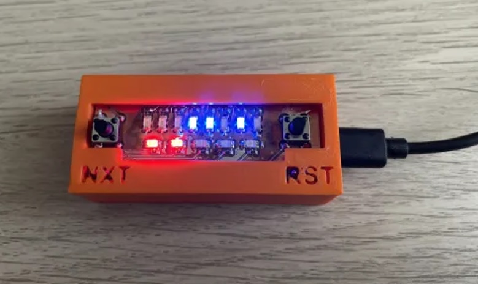
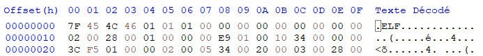
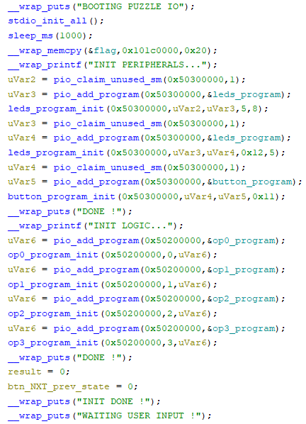
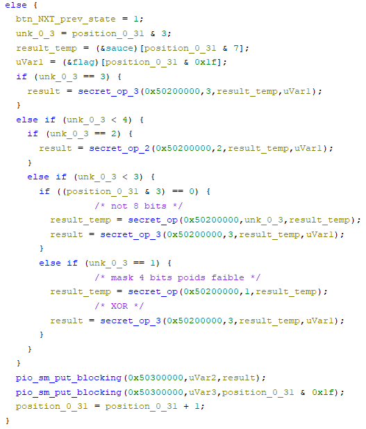

# Insomni’hack 2024 CTF – Puzzle_IO – by Phil242

*Puzzle_IO is a challenge created by _Az0x_ for Insomni'hack CTF. The challenge was solved by Phil242 and Baldanos*

Puzzle_IO is classified as a Hardware + Reverse challenge, marking a promising start to this new Insomni’Hack CTF edition. Baldanos and I decided to have a look at this one together.
We were provided with a binary file along with the usual advice on what to do for the challenge. It became evident early on that this was a crack-me challenge, and all start by the recognition step: you need to go to the admin desk and play with the device.



Interacting with the device was simple: it had a RESET button and a NEXT button. Pressing NEXT caused the LEDs to flash, while RESET initiated a cool animation with the LEDs flashing. Each press of NEXT revealed a different state. Quickly, we understood that the lower 5 red LEDs indicated the current state number, giving the clue of a total of 32 different deterministic states.
But how would it reveal a flag? 
Link to video: [YouTube](https://www.youtube.com/watch?v=3iDQmvBbDjM).


Upon examining the first bytes of the binary, we noticed « ELF, » indicating it was time to fire up Ghidra.



Most of the labels were present, and strings indicated that the SDK was called « pico. » Given the form factor of the device and the numerous occurrences of « pico » strings, we were fairly confident that a Raspberry Pi Pico was being used, featuring the tiny RP2040 MCU.
Although Ghidra 11 successfully opened it, even without the hardware description of the MCU peripherals, the labels provided enough information to understand what was happening on the device.




The most notable observation was that the “flag” byte array was copied from an unknown zone to memory. It was then processed by the code to produce the different LED states. The goal became instantly clear: we needed to compute the original flag byte vector from the 32 different LED states. But wait – there was no code in the various functions, only hardware calls.




So, we need to go deeper…
Based on news reports about the RP2040 chip reaching end-users, we were aware of its killer feature: real-time units running alongside the main core (no needs of interrupts or DMA). Reversing the beginning of the firmware revealed an extensive usage of these Programmable I/O, or « PIO. »
Now, the objective was 100% clear: we needed to reverse-engineer the main firmware, then reverse the extra code sent to the PIO to retrieve this « flag » byte array. We identified 6 PIO initializations, 2 for handling the LEDs and 4 for transforming the bytes sent to them.
The fun part began when we realized that these PIO were something other than the main ARM CPU core, meaning the CPU architecture wasn’t the same. We had to find a way to disassemble them. Our first attempt involved installing the official tools, including a full simulator, which was successfully installed but far too much complex to use in our context (since we only had a simple .elf file available).

After some digging, we found a simple Python script that only required the bytes to disassemble. However, it failed initially. After a few minutes, we realized it was due to an endianness problem. We swapped each pair of bytes to compose a 16 bits word, and it worked like a charm.

```
> python piodisasm.py op0.hex
; Generated by piodisasm

.program piodisasm_result

; program starts here

    pull block
    in OSR, 4
    in NULL, 28
    push block


> python piodisasm.py op1.hex
; Generated by piodisasm

.program piodisasm_result

; program starts here

    pull block
    in OSR, 4
    in NULL, 28
    push block


> python piodisasm.py op2.hex
; Generated by piodisasm

.program piodisasm_result

; program starts here

label_0x0:
    pull block
    mov X, !OSR
    pull block
    mov Y, OSR
    jmp label_0x6
label_0x5:
    jmp X-- label_0x6
label_0x6:
    jmp Y-- label_0x5
    mov ISR, !X
    push block
    jmp label_0x0


> python piodisasm.py op3.hex
; Generated by piodisasm

.program piodisasm_result

; program starts here

label_0x0:
    pull block
    mov X, OSR
    pull block
    mov Y, OSR
    jmp X!=Y label_0x6
    jmp label_0x8
label_0x6:
    set X, 1
    jmp label_0x9
label_0x8:
    set X, 0
label_0x9:
    mov ISR, X
    push block
    jmp label_0x0
```    
By combining traditional reverse engineering on the ARM binary with the 4 operations done by the PIO, this Python code summarized the reverse code, revealing the flag. Code by Baldanos.

```python
import numpy  as np
result = [ 0b00010100, 0b00010010, 0b00101000, 0b01011000, 0b00100001, 0b00010100, 0b01111000, 0b10110011, 0b11001010, 0b01101100, 0b10101111, 0b10001010, 0b01101111, 0b10101010, 0b10111111, 0b01001111, 0b01111100, 0b10101010, 0b00101111, 0b01000000, 0b11011111, 0b01101100, 0b00000010, 0b01000111, 0b01001100, 0b01001100, 0b01101100, 0b01000100, 0b01011001, 0b00010100, 0b10011111, 0b00000011]

sauce = b'\x9e\xb6\xc1\x61\x56\x85\xcc\xbd'

for  c in range(len(result)):
    if c&3 ==0 :
        a = np.bitwise_not(sauce[c&7])& 0xff
        b = int(bin(result[c])[2:].zfill(8)[::-1], 2)
        print(chr(a ^ b), end='')
    elif  c&3 == 1:
        a = sauce[c&7]&0x0f
        b = int(bin(result[c])[2:].zfill(8)[::-1], 2)
        print(chr(a ^ b), end='')
    elif c&3 == 2:
        X = sauce[c&7]
        Y = int(bin(result[c])[2:].zfill(8)[::-1], 2)
        Y = np.bitwise_not(Y) & 0xff
        X = X+Y & 0xff
        print(chr(np.bitwise_not(X)&0xff), end='')
    elif c&3==3:
        a = sauce[c&7]& 0xff
        b = int(bin(result[c])[2:].zfill(8)[::-1], 2)
        print(chr(a ^ b), end='')
``` 
Flag printed by this code: INS{–Rp2040_P1O_S3cR3t_S4uC3–}

In conclusion, although it was a « puzzle » and not a real-life scenario, it was highly intriguing, particularly regarding the PIO. The 3D-printed case and the fancy LED animation at power-up show the author’s attention to aesthetics. And last but not least, a XOR was used to decode stuff, another good point. This challenge was fun, and we send our thanks to Azox for creating it. GG guyz!

> This writeup was originally posted on the author's blog on https://phil242.wordpress.com/2024/04/27/insomnihack-2024-ctf-puzzle_io-by-azox/