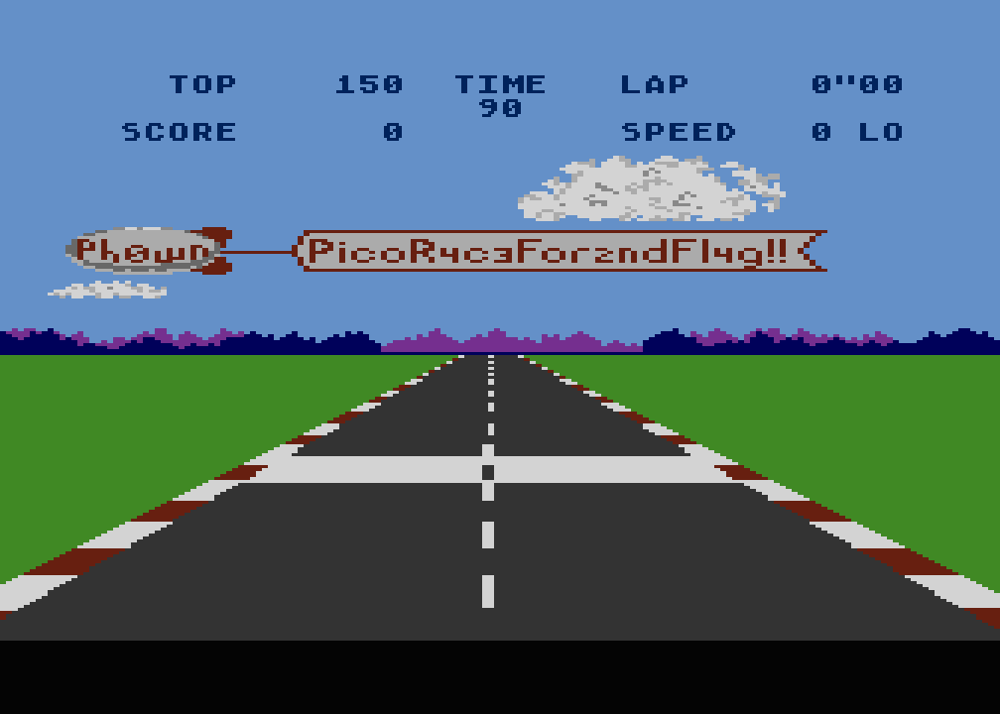
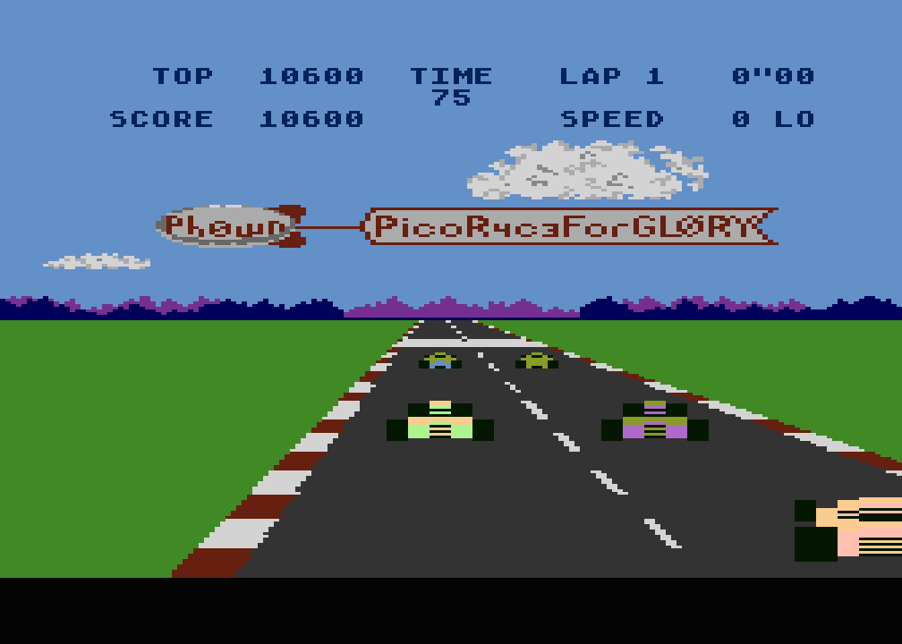

# Retro Gaming: Prepare to Qualify - by Euphoric

*Translated from French by ChatGPT*

## Description

A nice racing game is on a cassette close to the organizer's desk. Want to play for a flag?

Stage 1. Prepare to qualify for a flag :)
Stage 2. Win the qualification round for another flag :)

Cassettes and cassette readers are old prehistoric models which require to be handled with care. Please be gentle to them, they are the personal belongings of some ph0wn participants...


## Reading the Information

On the cassette covers, the following legend is written:

**Side A - Ph0wn "Prepare to qualify"**, which appears to be the only title recorded on side A.

One or two three-digit numbers are associated with this title. The first is **004**, while the second varies on two of the cassettes and is absent on the third cassette. These numbers indicate the recording position on the tape, as shown by the three-digit tape counter.

- The first counter value (**004**) is close to **000**. It’s recommended not to record a track right at the beginning of the tape because a small section of the tape isn’t magnetized. This can be seen as the tape material has a distinctly different color at the start.
- The second counter value indicates the end position of the recording. It varies depending on the tape's recording capacity (e.g., 60 minutes, 90 minutes, etc.). Since the tape is driven by spindles and its length varies, the diameter of the wound tape changes continuously during playback, affecting the linear speed of the tape.

This isn’t particularly significant, as the duration of the recording is also given: **7 minutes and 15 seconds**.

Finally, an important note is written: **"mono track, not for 410 / 1010"**.

- **Mono track**: The recording is in *mono*, not stereo. This aligns with the three cassette players, which are also mono. Most portable cassette players were mono, while stereo playback heads were initially reserved for Hi-Fi systems. Stereo portable cassette players arrived later, primarily for replaying Hi-Fi recordings.

- **"Not for 410 / 1010"**: A quick Google search for "410 1010 cassette" reveals that these refer to Atari 410 and Atari 1010 cassette players. Wikipedia's *Atari Program Recorder* page confirms that the Atari 410 was used with the Atari 400 and 800 systems. A photo of the Atari 410 shows a strong resemblance to the cassette players at Ph0wn.

Since there is no Atari machine at the Ph0wn table, an *emulator* and the ability to transfer the cassette’s recording to a virtual cassette will be required.

A Google search for "Atari 400 800 emulator" suggests **Altirra** as the best Atari 400/800/XL emulator for Windows, while **Atari++** and **Atari800** are cross-platform options for Linux and macOS.

For converting a `.wav` file to a virtual Atari cassette format, the tools `wav2cas` and `a8cas` are recommended. *a8cas* is described as a superset of wav2cas with added features.

The cassette will need to be sampled and digitized.

## Digitizing the Cassette on PC/Mac

Two of the three cassette players on the table are connected to cables with a 4-pin jack plug (CTIA standard, compatible with most PCs and many smartphones except Apple). One cable has a label indicating it connects the tape-out signal to the PC's microphone input. The third cassette player has a cable with an integrated USB audio interface for PCs/Macs without a jack port.

Steps:

1. **Rewind the cassette** if necessary (Rewind button `<<`). Optionally reset the tape counter to `000` if it has shifted (this is optional, as the signal will be visualized during digitization).
2. **Start playback** (Play button `>`). The cassettes are protected against accidental recording by a broken recording tab, though this can be bypassed with adhesive tape.
3. On the PC, use a tool like **Audacity** to record the signal from the microphone input in **mono** (single channel). Sampling rates of **48 kHz** or **44.1 kHz** work well. After a few seconds, a strong signal (at least half of the maximum amplitude) should appear. Record for more than **7 minutes and 15 seconds**, stopping when the strong signal ends.
4. **Trim the recording** to simplify conversion for *a8cas*. Cut off the first few seconds (the synchronization tone’s duration can be shortened). Avoid trimming the end to preserve the full program (the signal stops abruptly after the data ends).
5. Export the trimmed recording as a **.wav file** in mono, 16-bit format.

## Conversion with a8cas

Run the following command:

```bash
a8cas <input_file.wav> <output_file.cas>
```

The tool will handle the conversion, though it may report minor errors near the tape’s end due to weak signals.

## Loading the Program with an Atari 8-bit Emulator

Emulators typically don’t include system ROMs due to copyright. You’ll need to obtain the `ATARIOSB.ROM` (e.g., from Internet Archive). Alternatively, Altirra provides high-level ROM emulation without requiring the original ROM (to be confirmed).

> @cryptax note: for the ROMs, read the [install notes](https://github.com/atari800/atari800/blob/master/DOC/INSTALL), or `/usr/share/doc/atari800/FAQ`

To boot from the cassette:

- With Altirra, use the menus to load the tape.
- With [Atari800](https://github.com/atari800/atari800), use the command-line option: `atari800 -boottape <file.cas>`

> @cryptax note: `atari800 -win-width 1024 -win-height 768 -xl -osb_rom ./ATARIOSB.ROM -xlxe_rom ./ATARIXL.ROM -boottape ./Ph0wn.cas` works well :)

If the emulator doesn’t patch the SIO routines for faster tape loading, it will take 30 seconds to load the first part (a loader) and over 5 minutes and 30 seconds for the main program.

> @cryptax: if you don't want to wait, in `~/.atari800.cfg`, `ENABLE_SIO_PATCH=1`

The game Pole Position will start, with the first Ph0wn flag carried by a blimp crossing the screen.




## Retrieving the Second Flag

To retrieve the second flag, complete the qualification lap and place in the top 8.

  -  Obtain the Pole Position manual (e.g., from Internet Archive). It explains the controls, including gear shifting.
  -  Configure the emulator to map the PC/Mac keyboard keys for gameplay.
  
  
