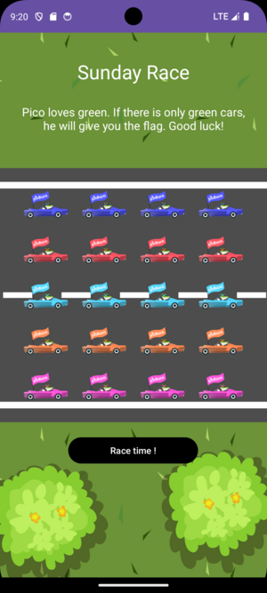
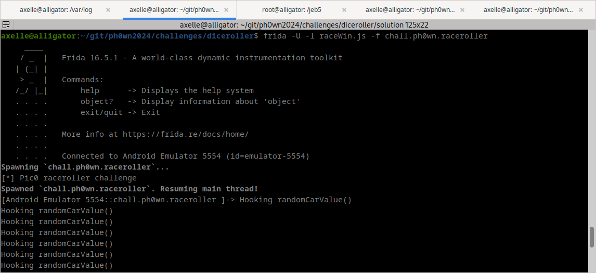
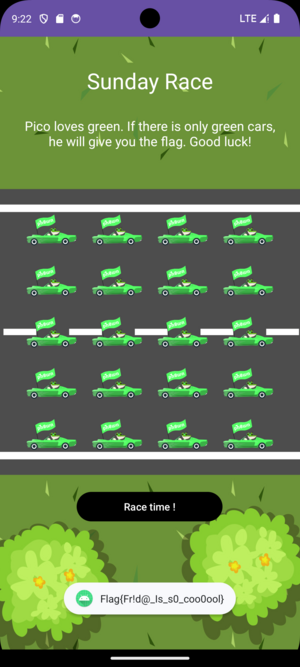

# Reverse challenges at Ph0wn 2024

## Race Roller - writeup by Cryptax

This challenge was created by *Guerric Eloi*.

### Reconnaissance

We install the application in an Android emulator. It is the "Sunday Race" application, and the application says we'll get a flag if all cars are green.



There are 20 cars, and at least 6 colors, so we'd be extremely lucky to get that.

### Decompiling the app

This year, there was a [JEB workshop](https://pnfsoftware.com) at Ph0wn, so we use JEB to decompile the application.

The main activity of the application is `chall.ph0wn.raceroller.MainActivity`. The app looks very simple: a single activity. The app was obviously written in *Kotlin*.

```java
import kotlin.Metadata;
import kotlin.collections.CollectionsKt;
import kotlin.jvm.internal.DefaultConstructorMarker;
import kotlin.jvm.internal.Intrinsics;
import kotlin.random.Random;
import kotlin.text.Charsets;
import kotlin.text.StringsKt;
```

The `onCreate()` method sets up a list of 20 car images:

```java
this.carImages = CollectionsKt.listOf(new ImageView[]{this.findViewById(id.car1), ...
```

When the button is clicked, 20 random integers are generated, stored in an array and converted to the right image resource. The function which generates the random value is `randomRaceValue()`.

If we array contains 20 times the value 5 (which probably stands for green), a flag is decrypted:

```java
for(int v4 = 0; true; ++v4) {
    if(v4 >= 20) {
        String s = MainActivity.Companion.generateKey();
        Toast.makeText(this, MainActivity.Companion.decryptFlag(this.encryptedFlag, s), 0).show();
        break;
    }

	if(arr_v[v4] != 5) {
        break;
    }
}
```	

The encrypted flag is a base64 encoded string:

```java
 public MainActivity() {
        this.encryptedFlag = "rRX0o5VF6Rlz6aHlL+qH9jUtobYXmVcVAfq72Z4nOGA=";
    }
```

The decryption algorithm uses AES-ECB.

```java
private final String decryptFlag(String s, String s1) {
    String s2;
    try {
        Cipher cipher0 = Cipher.getInstance("AES/ECB/PKCS5Padding");
        byte[] arr_b = s1.getBytes(Charsets.UTF_8);
        Intrinsics.checkNotNullExpressionValue(arr_b, "this as java.lang.String).getBytes(charset)");
        cipher0.init(2, new SecretKeySpec(arr_b, "AES"));
        byte[] arr_b1 = cipher0.doFinal(Base64.getDecoder().decode(s));
        s2 = "Erreur de dechiffrement";
        Intrinsics.checkNotNull(arr_b1);
        return new String(arr_b1, Charsets.UTF_8);
    }
    catch(Exception unused_ex) {
		return s2;
    }
}
```		

The AES key is `arr_b`, which corresponds to the second argument `s1`.
So, it's actually `s`, from `generateKey`:

```java
String s = MainActivity.Companion.generateKey();
```

### Solution Options

The decompilation of `generateKey` is obscure on purpose. Either we can try and make sense out of it, or we can try another way. Both options are possible.
The first one is probably the hardest but yet feasible.

#### Option 1: Understand generateKey

We can quickly notice `generateKey` is riddled with junk code:

```java
// junk code
int[] arr_v = new int[10];
for(int v1 = 0; v1 < 10; ++v1) {
    arr_v[v1] = (int)(Math.random() * 100.0);
}

// useful
Collection collection0 = new ArrayList(4);
for(int v2 = 0; v2 < 4; ++v2) {
    collection0.add(Character.valueOf(((char)("7529".charAt(v2) + 3))));
}

// junk code
int v3 = 0;
int v4 = 0;
while(v4 < 10) {
	int v5 = arr_v[v4];
    int v6 = (v4 + 3) * v5;
    ++v4;
    v3 += v6 - v5 / v4;
}
```			

#### Option 2: Frida

In the second option, we are going to "cheat" and have `randomRaceValue()` always return 5 (green).

```java
public final int randomRaceValue() {
	return Random.Default.nextInt(1, 7);
}
```

This can easily be done with a Frida hook. The function to hook is `randomRaceValue()`. It is in the inner `Companion` class of the `MainActivity`:

```javascript
'use strict';

console.log("[*] Pic0 raceroller challenge");
Java.perform(function() {
    var companion = Java.use("chall.ph0wn.raceroller.MainActivity$Companion");
    companion.randomRaceValue.implementation = function() {
    console.log("Hooking randomCarValue()");
    return 5;
    }

});
```

We launch a Frida server in the emulator, install the application, and launch the Frida script: `frida -U -l raceWin.js -f chall.ph0wn.raceroller`




