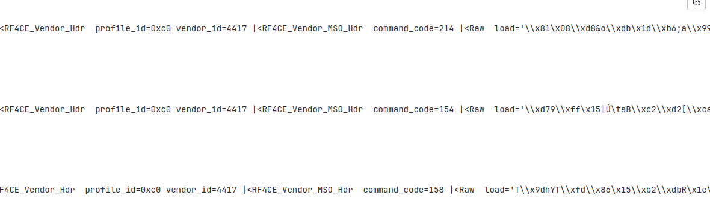
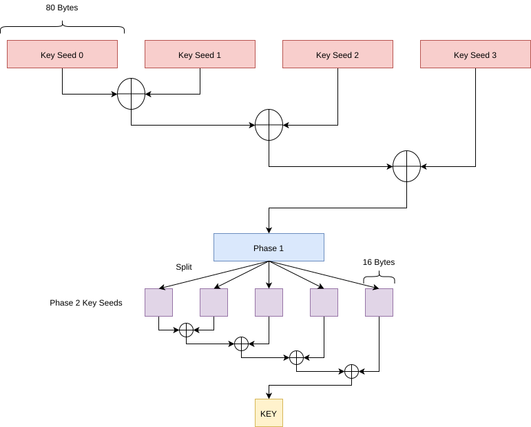
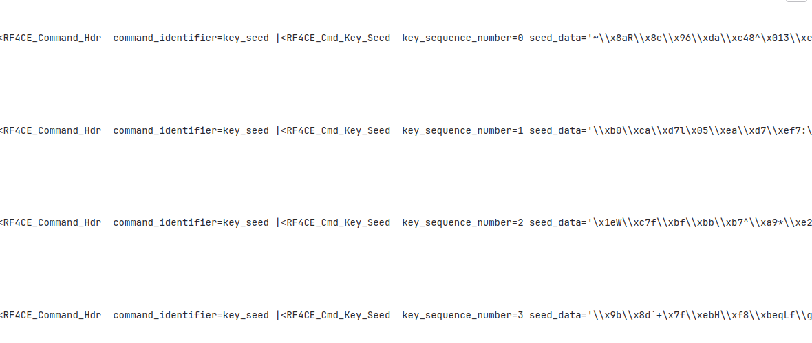
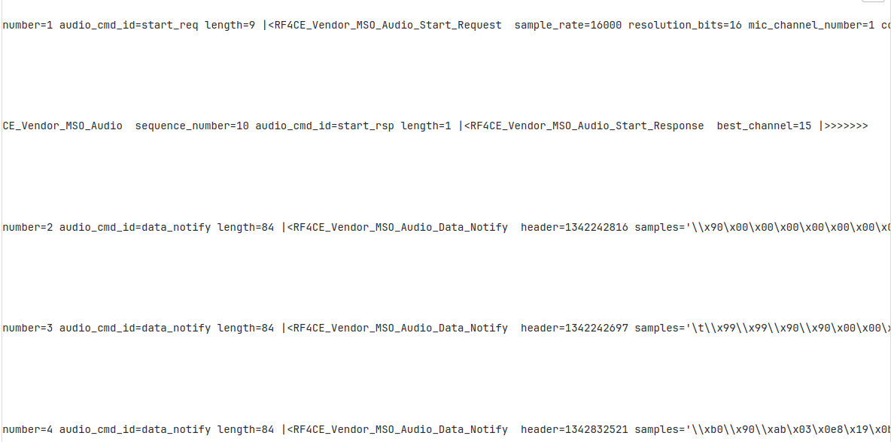

# Network challenges at Ph0wn 2024: Picobox Revolution by Romain Cayre

## Identifying the protocol

The challenge indicates that a fancy RF protocol is used for the wireless communication between the Picobox Revolution and its remote control, and the first step is to identify what this protocol is. 
In the challenge description, the chip used by the remote control is indicated: it's a [TLSR8278](https://wiki.telink-semi.cn/wiki/chip-series/TLSR827x-Series/), a RF chip from Telink. By looking at [the datasheet](https://wiki.telink-semi.cn/doc/ds/DS-TLSR8278-E_Datasheet%20for%20Telink%20BLE%20+%20IEEE%20802.15.4%20Multi-Standard%20Wireless%20SoC%20TLSR8278.pdf), we can see that it supports three main protocols: Bluetooth Low Energy, ZigBee and RF4CE. 

If we open the PCAP file "remotecontrol.pcap" in wireshark, we can see that the traffic is identified as 802.15.4, but is not dissected as ZigBee. We can conclude that the protocol in use is probably [RF4CE](https://wiki.telink-semi.cn/wiki/solution/RCU/RF4CE/), a lightweight variant of ZigBee designed for Remote Control. 

We can also note that "Picobox Revolution" is a reference to the "Freebox Revolution", a well-known set-top-box in France provided by the Free mobile operator. Its remote control was one of the first device to use this RF4CE technology. 

## Analyzing the PCAP file

The [WHAD framework](https://whad.io) includes support for RF4CE and provides a set of tools facilitating the traffic analysis.
Once installed, you can use the *wplay* command to display and dissect the packets captured from the PCAP file:
```
$ wplay remotecontrol.pcap
```

However, we can see that a lot of packets are encrypted:




We need to find a way to retrieve the encryption key. If we search on the internet for "rf4ce security", we can find two blogposts from River Loop Security, discussing the security of RF4CE protocol:

- [Article 1: RF4CE Protocol Introduction](https://riverloopsecurity.com/blog/2019/08/rf4cept1/)
- [Article 2: RF4CE Security Overview](https://riverloopsecurity.com/blog/2019/08/rf4ce-security-overview/)

In the second article, an attack is described allowing to retrieve the encryption key from the traffic captured during the pairing process. Indeed, if we are able to extract the seeds transmitted over the air, we can derive the key according to the following scheme:

.

In our case, we captured the following seeds:



Based on this capture, we should be able to retrieve the key by applying the derivation scheme on these seeds. We can easily run this attack using *WHAD*, thanks to the *wanalyze* CLI tool:
```
$ wplay --flush remotecontrol.pcap | wanalyze 
[X] key_cracking -> completed
  - key:  17f2dd2d8f1c1d463e74d08f5c94d5db
```

Once the key has been retrieved, we can decrypt the traffic using the option *-d* (decrypt) and the option *-k* (key):
```
$ wplay --flush remotecontrol.pcap -d -k 17f2dd2d8f1c1d463e74d08f5c94d5db 
```

## Extracting the audio stream

Once decrypted, we can see that the capture includes an audio stream, encoded using an ADPCM codec with a sample rate of 16,000 Hz and a resolution of 16 bits. We can identify it thanks to the [RF4CE scapy dissector implemented in WHAD](https://github.com/whad-team/whad-client/blob/main/whad/scapy/layers/rf4ce.py), or by reading the source code of the [Telink RF4CE SDK](https://wiki.telink-semi.cn/tools_and_sdk/RF4CE/RF4CE_SDK.zip) after downloading it on the [Telink website](https://wiki.telink-semi.cn/).




We can automatically extract it from the decrypted traffic using *wanalyze* with the traffic analyzer named *"audio.raw_audio"* and the *--raw* option to get the raw bytes:
```
$ wplay --flush remotecontrol.pcap -d -k 17f2dd2d8f1c1d463e74d08f5c94d5db | wanalyze --raw audio.raw_audio > stream.wav
```

## Retrieving the flag

Once we have the audio stream, all we have to do is to listen to the recording, that provides a sequence of digits and letters similarly to a number station:
**7 0 6 8 3 0 7 7 6 e 7 b 7 2 6 6 3 4 6 3 3 3 3 1 7 3 6 2 7 2 3 0 6 b 3 3 6 e 7 d**

It looks like a hexadecimal string. Once converted in UTF-8, it indicates the flag:

```
$ python3 -c 'print(bytes.fromhex("706830776e7b726634633331736272306b336e7d").decode("utf-8"))'
ph0wn{rf4c31sbr0k3n}
```
