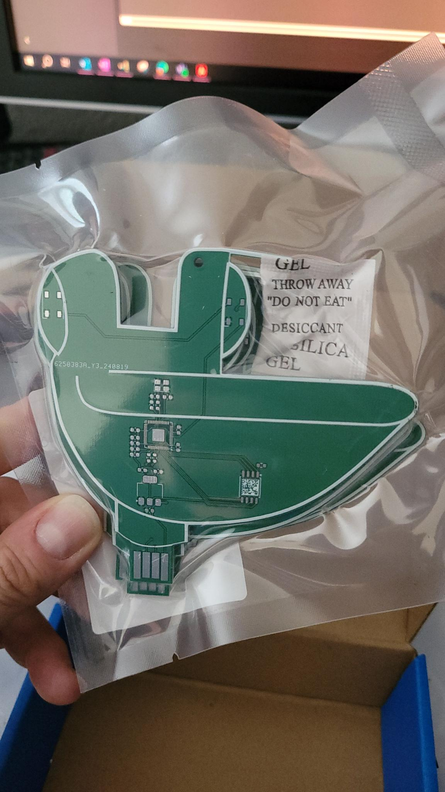
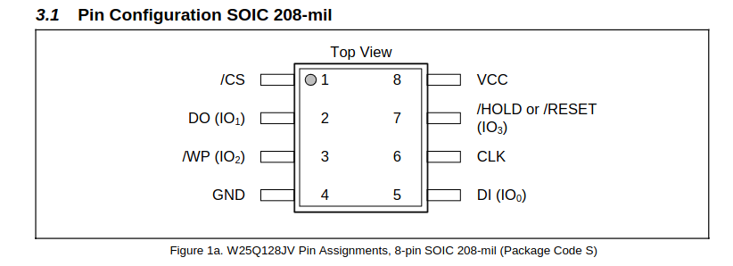
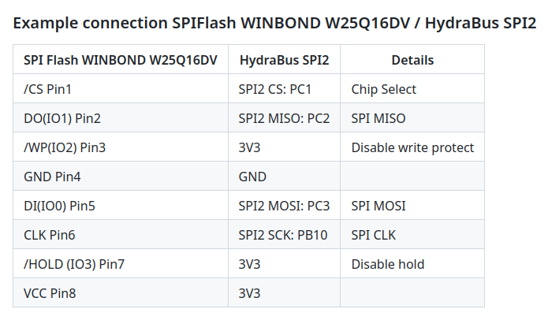
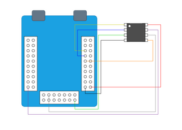
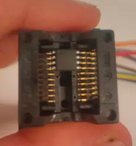
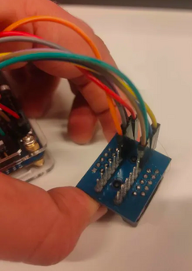
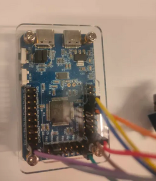
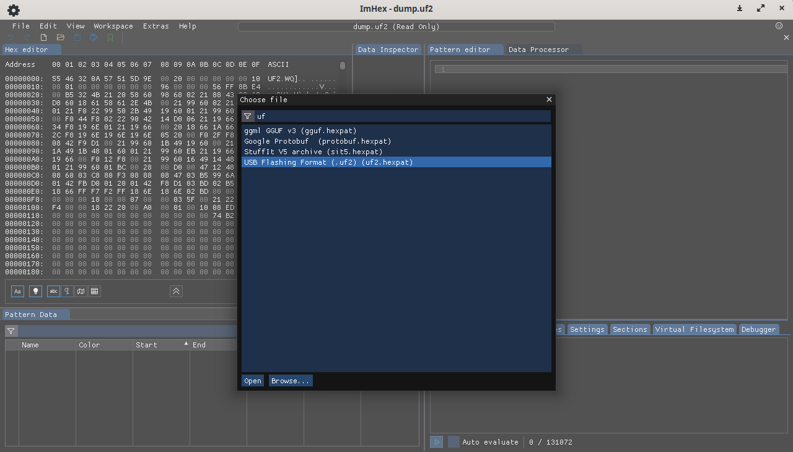
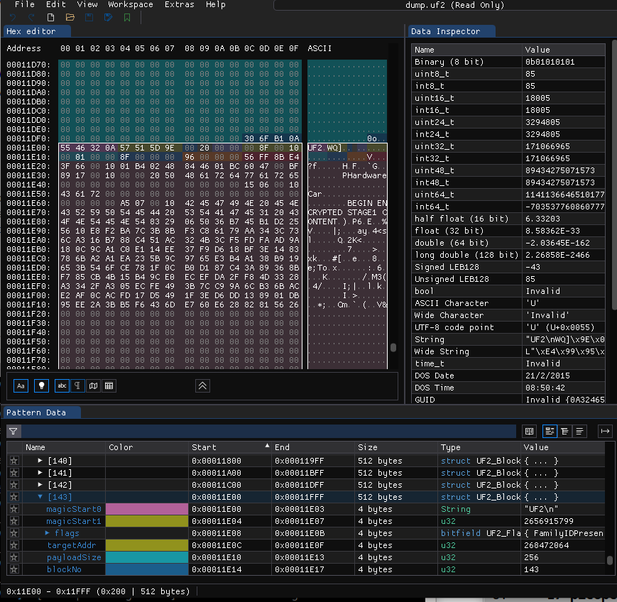

# Hardware challenge at Ph0wn 2024: Pico PCB 1 by Cryptax

The PCB was designed by *Balda*. The challenge was created by *Cryptax*, and tested by *Romain Malmain*.

## Description

Pico lost a flag. He can't remember where it is on the PCB. Stupid, isn't it?

1. Locate Pico's memory
2. Look under the carpet. The hot air stations might help you.
3. You'll need to put everything back in place for stage 2.

## Connecting to the board

Connect the Pico PCB board to your laptop and talk to it:

```
$ picocom -b 115200 /dev/ttyACM0
Pico PCB Loader v0.1...
-----------------------------
Welcome to the Pico PCB Board
Stage 1: Hardware
Stage 2: Car
Select challenge: Hardware
Hardware challenge ---------
Amnesia. Something is hidden deep down in my memory but I cant understand it.
```

## Un-solder the memory

The board talks about a *memory* + the challenge insists on *memory* and looking under the carpet + the Flash memory is isolated on the board. So, we un-solder the memory... and find there is a QR code underneath!

> Romain: it's easy to un-solder with hot air, but risky with a soldering iron...



## Read the QR code

We scan it and it goes to : **ph0wn.org/pcb-key**. 
We go to https://ph0wn.org/pcb-key:

```
http://chal.ph0wn.org:9099/pcb-key
```

So, we go to http://chal.ph0wn.org:9099/pcb-key:

```
algo: AES-CBC
key: thanks_to_balda!
IV:  butter_soldering
```

## Read the memory

There are several solutions at this point:

1. Read the memory using a **Hydrabus** and `flashrom`
2. Read the memory using a **CH341**. Reading the EEPROM in situ with the clip doesn’t work. The EEPROM needs to be desoldered, placed on the appropriate socket, and read using `flashrom`.
3. Dump the firmware using `picotool` before un-soldering the memory, or after soldering it back.

For the first 2 solutions, 

- Download and install [Flashrom](https://www.flashrom.org/)
- Pay attention to the orientation of the memory: a dot helps you to identify pin 1.



- Hydrabus: [using Flashrom with Hydrabus](https://github.com/hydrabus/hydrafw/wiki/HydraFW-SPI-guide#flashrom-usage)











- CH341: [follow this guide](https://winraid.level1techs.com/t/guide-flash-bios-with-ch341a-programmer/32948). Pay attention to where to put the read wire.

For the *software* solution, install [Pico SDK](https://github.com/raspberrypi/pico-sdk). On Linux:

```
cd softs
wget https://raw.githubusercontent.com/raspberrypi/pico-setup/master/pico_setup.sh`
chmod u+x pico_setup.h
./pico_setup.sh
export PICO_SDK_PATH=~/softs/pico/pico-sdk
```

Then, connect the board and download the firmware with `picotool`: 

```
$ sudo $PICO_SDK_PATH/../picotool/build/picotool save -f ./firmware.uf2
Saving file: [==============================]  100%
Wrote 76800 bytes to dump.uf2
```


## Analyzing the UF2

Load the firmware in a hexadecimal editor and notice `BEGIN ENCRYPTED STAGE1 CONTENT` and `END ENCRYPTED STAGE2 CONTENT`.

```
$ hexdump -C firmware.uf2
...
00011e60  00 00 00 00 a5 07 00 10  42 45 47 49 4e 20 45 4e  |........BEGIN EN|
00011e70  43 52 59 50 54 45 44 20  53 54 41 47 45 31 20 43  |CRYPTED STAGE1 C|
00011e80  4f 4e 54 45 4e 54 83 29  06 50 36 b7 45 b1 d2 25  |ONTENT.).P6.E..%|
00011e90  56 10 e8 f2 ba 7c 3b 8b  f3 c8 61 79 aa 34 3c 73  |V....|;...ay.4<s|
00011ea0  6c a3 16 b7 88 c4 51 ac  32 4b 3c f5 fd fa ad 9a  |l.....Q.2K<.....|
00011eb0  18 0c 9c a1 c0 e1 14 ee  37 f9 d6 18 bf 3e 14 83  |........7....>..|
00011ec0  78 6b a2 a1 ea 23 5b 9c  97 65 e3 b4 a1 38 b9 19  |xk...#[..e...8..|
00011ed0  65 3b 54 6f ce 78 1f 0c  b0 d1 87 c4 3a 89 36 8b  |e;To.x......:.6.|
00011ee0  f7 85 cb 4b 15 b4 9c e0  ec ef da 2f f8 4d 33 28  |...K......./.M3(|
00011ef0  a3 34 2f a3 05 ec fe 49  3b 7c c9 9a 6c b3 6b ac  |.4/....I;|..l.k.|
00011f00  e2 af 0c ac fd 17 d5 49  1f 3e d6 dd 13 89 01 db  |.......I.>......|
00011f10  95 ee 2a 3b b5 f6 43 6d  e7 60 e6 28 82 81 56 26  |..*;..Cm.`.(..V&|
00011f20  00 00 00 00 00 00 00 00  00 00 00 00 00 00 00 00  |................|
*
00011ff0  00 00 00 00 00 00 00 00  00 00 00 00 30 6f b1 0a  |............0o..|
00012000  55 46 32 0a 57 51 5d 9e  00 20 00 00 00 90 00 10  |UF2.WQ].. ......|
00012010  00 01 00 00 90 00 00 00  96 00 00 00 56 ff 8b e4  |............V...|
00012020  ca b7 62 46 6c 21 6c 53  68 06 66 e2 48 d2 b0 e7  |..bFl!lSh.f.H...|
00012030  fd d7 2d 6c af 66 81 0e  f1 48 ee 63 ab fc b3 9e  |..-l.f...H.c....|
00012040  4c 86 b2 ef ca 56 1a 98  82 aa 49 bb 93 16 1e 46  |L....V....I....F|
00012050  78 82 9b d9 e6 0b 45 4e  44 20 45 4e 43 52 59 50  |x.....END ENCRYP|
00012060  54 45 44 20 53 54 41 47  45 31 20 43 4f 4e 54 45  |TED STAGE1 CONTE|
00012070  4e 54 10 00 00 00 00 00  00 00 01 00 00 00 00 00  |NT..............|
```




The encrypted content is obviously split with a big zero zone in the middle. It may be difficult to pick exactly the right data. There are two solutions: (1) extract the binary from the UF2, or (2) try to be lucky and decrypt the first blob.

## Alternative 1: Extract the binary

We ask ChatGPT to write a script that extract the binary from UF2:

```python
import struct

# Constants for UF2 format
UF2_BLOCK_SIZE = 512
UF2_FLAG_FAMILYID_PRESENT = 0x00002000
UF2_MAGIC_START0 = 0x0A324655  # "UF2\n"
UF2_MAGIC_START1 = 0x9E5D5157  # Randomly selected
UF2_MAGIC_END = 0x0AB16F30     # Randomly selected

def parse_uf2(file_path):
    with open(file_path, 'rb') as file:
        blocks = []
        
        while True:
            block = file.read(UF2_BLOCK_SIZE)
            if len(block) < UF2_BLOCK_SIZE:
                break
            blocks.append(block)
        
        return blocks

def extract_data(blocks):
    data = bytearray()
    
    for block in blocks:
        # Unpack the header of the UF2 block
        header = struct.unpack_from('<IIIIIIIIIIII', block, 0)
        magic_start0, magic_start1, flags, target_addr, payload_size, block_no, num_blocks, file_size, family_id, _ = header[:10]

        # Validate the UF2 magic numbers
        if magic_start0 != UF2_MAGIC_START0 or magic_start1 != UF2_MAGIC_START1:
            print("Invalid UF2 magic numbers")
            continue
        
        # Extract the payload
        payload = block[32:32 + payload_size]
        data.extend(payload)
    
    return data

def save_extracted_data(data, output_file):
    with open(output_file, 'wb') as file:
        file.write(data)

# Example usage
uf2_file_path = 'firmware.uf2'
output_file_path = 'extracted_data.bin'

# Parse the UF2 file
uf2_blocks = parse_uf2(uf2_file_path)

# Extract the data
extracted_data = extract_data(uf2_blocks)

# Save the extracted data to a binary file
save_extracted_data(extracted_data, output_file_path)

print(f"Extracted data saved to {output_file_path}")
```

We run it on our firmware:

```
$ python3 parse_uf2.py 
Extracted data saved to extracted_data.bin
```

We retrieve the entire encrypted zone:

```
00008f40  00 00 00 00 a5 07 00 10  42 45 47 49 4e 20 45 4e  |........BEGIN EN|
00008f50  43 52 59 50 54 45 44 20  53 54 41 47 45 31 20 43  |CRYPTED STAGE1 C|
00008f60  4f 4e 54 45 4e 54 83 29  06 50 36 b7 45 b1 d2 25  |ONTENT.).P6.E..%|
00008f70  56 10 e8 f2 ba 7c 3b 8b  f3 c8 61 79 aa 34 3c 73  |V....|;...ay.4<s|
00008f80  6c a3 16 b7 88 c4 51 ac  32 4b 3c f5 fd fa ad 9a  |l.....Q.2K<.....|
00008f90  18 0c 9c a1 c0 e1 14 ee  37 f9 d6 18 bf 3e 14 83  |........7....>..|
00008fa0  78 6b a2 a1 ea 23 5b 9c  97 65 e3 b4 a1 38 b9 19  |xk...#[..e...8..|
00008fb0  65 3b 54 6f ce 78 1f 0c  b0 d1 87 c4 3a 89 36 8b  |e;To.x......:.6.|
00008fc0  f7 85 cb 4b 15 b4 9c e0  ec ef da 2f f8 4d 33 28  |...K......./.M3(|
00008fd0  a3 34 2f a3 05 ec fe 49  3b 7c c9 9a 6c b3 6b ac  |.4/....I;|..l.k.|
00008fe0  e2 af 0c ac fd 17 d5 49  1f 3e d6 dd 13 89 01 db  |.......I.>......|
00008ff0  95 ee 2a 3b b5 f6 43 6d  e7 60 e6 28 82 81 56 26  |..*;..Cm.`.(..V&|
00009000  ca b7 62 46 6c 21 6c 53  68 06 66 e2 48 d2 b0 e7  |..bFl!lSh.f.H...|
00009010  fd d7 2d 6c af 66 81 0e  f1 48 ee 63 ab fc b3 9e  |..-l.f...H.c....|
00009020  4c 86 b2 ef ca 56 1a 98  82 aa 49 bb 93 16 1e 46  |L....V....I....F|
00009030  78 82 9b d9 e6 0b 45 4e  44 20 45 4e 43 52 59 50  |x.....END ENCRYP|
00009040  54 45 44 20 53 54 41 47  45 31 20 43 4f 4e 54 45  |TED STAGE1 CONTE|
00009050  4e 54 10 00 00 00 00 00  00 00 01 00 00 00 00 00  |NT..............|
```

Then, we decrypt it using AES-CBC, with the key we got from the QR code and the IV.

```python
import logging
from Crypto.Cipher import AES
import os

KEY_IV_FILE='./pcb-key'
FIRMWARE_FILE='extracted_data.bin'

# Set up logging
logging.basicConfig(level=logging.INFO, format='%(asctime)s - %(levelname)s - %(message)s')

def pad(data):
    """Pads the input data to be a multiple of 16 bytes (AES block size)."""
    padding_len = AES.block_size - len(data) % AES.block_size
    padding = bytes([padding_len] * padding_len)
    logging.info(f'Padding plaintext with {padding_len} byte(s).')
    return data + padding

def aes_cbc_decrypt(key, iv, data):
    """Encrypts data using AES CBC mode."""
    cipher = AES.new(key, AES.MODE_CBC, iv)
    logging.info('Starting AES CBC decryption.')
    decrypted_data = cipher.decrypt(data)
    logging.info('Decryption completed.')
    return decrypted_data

def read_key_iv(file_path):
    """Reads the key and IV from a file in the format 'key: <key>' and 'iv: <iv>'."""
    logging.info(f'Reading key and IV from file: {file_path}')
    with open(file_path, 'r') as f:
        lines = f.readlines()
        key_line = [line for line in lines if line.startswith("key:")][0]
        iv_line = [line for line in lines if line.startswith("IV:")][0]
        
        # Extract key and IV strings
        key = key_line.split("key:")[1].strip()
        iv = iv_line.split("IV:")[1].strip()

        # Ensure the key is exactly 16 bytes (AES-128) and IV is a 16-byte hex string
        if len(key) != 16 or len(iv) != 16:
            logging.error('Bad length: len(key)={len(key)} len(iv)={len(iv)}')
            raise ValueError("Key/IV must be exactly 16 bytes")
        
        logging.info(f'Key: {key}, IV: {iv}')
        return key.encode(), iv.encode()

# Main logic starts here
logging.info('Setup program to encrypt what we will put in the EEPROM.')

try:
    # Read the key and IV from the pcb-key file
    key, iv = read_key_iv(KEY_IV_FILE)

    logging.info(f'Reading input from file: {FIRMWARE_FILE}')
    with open(FIRMWARE_FILE, 'rb') as f:
        firmware = f.read()

    # Pad the plaintext to ensure it's a multiple of AES block size
    padded = pad(firmware[0x8f66:0x9036])

    # Encrypt the data using AES in CBC mode
    plaintext = aes_cbc_decrypt(key, iv, padded)
    logging.info(f'plaintext={plaintext}')

except Exception as e:
    logging.error(f"An error occurred: {str(e)}")
```

We run the program:

```
$ python3 decrypt.py 
2024-11-19 18:13:12,802 - INFO - Setup program to encrypt what we will put in the EEPROM.
2024-11-19 18:13:12,802 - INFO - Reading key and IV from file: ./pcb-key
2024-11-19 18:13:12,802 - INFO - Key: thanks_to_balda!, IV: butter_soldering
2024-11-19 18:13:12,802 - INFO - Reading input from file: extracted_data.bin
2024-11-19 18:13:12,802 - INFO - Padding plaintext with 16 byte(s).
2024-11-19 18:13:12,804 - INFO - Starting AES CBC decryption.
2024-11-19 18:13:12,805 - INFO - Decryption completed.
2024-11-19 18:13:12,805 - INFO - plaintext=b'Lesson to be learned: always look under the carpet!\nThis is your flag for the Pico PCB challenge: ph0wn{under_the_mag1c_karpet}\nWe recommend you solder back everything to play the other challenges.\x0b\x0b\x0b\x0b\x0b\x0b\x0b\x0b\x0b\x0b\x0b3\xe1E\xafS\xd2f\xaf\xe5\xa9\x10\xc2\xdf\xbbd\x9f'
```

We get the flag: `ph0wn{under_the_mag1c_karpet}`

## Alternative 2: be lucky

We modify the Python script above to operate on the UF2. The correct offset is:

```python
# Pad the plaintext to ensure it's a multiple of AES block size
    padded = pad(firmware[0x11e86:0x11f20])
```

We run the program, we won't get the entire plaintext, but fortunately enough to recover the flag:

```
$ python3 decrypt-lucky.py 
2024-11-19 18:14:31,849 - INFO - Setup program to encrypt what we will put in the EEPROM.
2024-11-19 18:14:31,849 - INFO - Reading key and IV from file: ./pcb-key
2024-11-19 18:14:31,849 - INFO - Key: thanks_to_balda!, IV: butter_soldering
2024-11-19 18:14:31,849 - INFO - Reading input from file: firmware-loader-backup.uf2
2024-11-19 18:14:31,849 - INFO - Padding plaintext with 6 byte(s).
2024-11-19 18:14:31,851 - INFO - Starting AES CBC decryption.
2024-11-19 18:14:31,852 - INFO - Decryption completed.
2024-11-19 18:14:31,852 - INFO - plaintext=b'Lesson to be learned: always look under the carpet!\nThis is your flag for the Pico PCB challenge: ph0wn{under_the_mag1c_karpet}\nWe recommend you\x1a\x9b\x85?\xd6\xfe\x0f\x94\xb2m+\xa6\xb5"\xc1\x1f'
```

