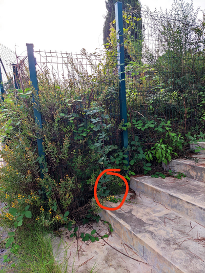

# Rookie challenges at Ph0wn 2024

## R2D2 Podrace by Cryptax

### Description

R2D2 is competing in a geocaching podrace. The droid received hexadecimal information from its ultrasound sensor and its infrared scanner:

-    Ultrasound: 336863
-    Infrared: 704320

Cosmic rays have potentially altered one character of that data (0 if you're lucky, 1 character at most). To check data validity, R2D2 uses CRC-8/LTE. If the checksum is correct, data is fine. If the checksum is incorrect, you'll need to fix the data.

-    CRC-8/LTE Ultrasound: 0x2A
-    CRC-8/LTE Infrared: 0xF6

Let's assume correct data for ultrasound is ABCDEF, and GHIJKL for infrared. Go to GPS coordinates N 4A deg BC.DEF et E 0G deg HI.JKL (yes, you need to leave the building). You'll find a hidden "surprise box" - the size of a small apple - at that location.

This challenge is actually also a [Geocache](https://www.geocaching.com/geocache/GCAZ2DK), which was created on purpose for Ph0wn.

### Solution


We check the CRC8 of 0x336863 and 0x704320. You can do that by implementing your own program, or using an [online website that computes CRC8](https://crccalc.com/?crc=336863&method=CRC-8/LTE&datatype=1&outtype=0). Be sure to select the correct algorithm (CRC-8/LTE) and hex input.

The CRC for 336863 is correct: 2A.
The CRC for 704320 is incorrect: it should be *94*, but the description says *F6*.

So, we need to find close whose CRC-8 would be *F6*.
We know that at most *1 character* changes. 
As the data is going to create GPS coordinates `E 0G deg HI.JKL`, we know that:

1. All characters are going to be between 0 and 9. Not hexademical A-F.
2. G and H are most certainly correct, or the resulting cache would be too far away.

We compute CRC8 for all remaining possibilities. There aren't many, and only one matches.

```python
def crc8_lte(data):
    polynomial = 0x9B  # Polynom for CRC-8/LTE
    crc = 0x00

    for byte in data:
        crc ^= byte 
        for _ in range(8): 
            if crc & 0x80: 
                crc = (crc << 1) ^ polynomial 
            else:
                crc <<= 1 
            crc &= 0xFF 

    return crc

for j in range(0, 4):
    data = list("704320")
    for i in range(0, 10):
        data[j+2] = f'{i}'
        result = crc8_lte(list(bytes.fromhex(''.join(data))))
        if result == 0xF6:
            print(f"---> Potential infrared data={''.join(data)}, crc={result}")
        else:
            print(f"data={''.join(data)} crc={result}")
```

Run it:

```
data=704020 crc=174
data=704120 crc=184
data=704220 crc=130
data=704320 crc=148
---> Potential infrared data=704420, crc=246
data=704520 crc=224
data=704620 crc=218
```

So, the geocache is located at  `N 43 36.863 E 007 04.420`. You'll easily find a R2D2 3D-printed box, attached at the bottom of a fense. The gloves are there to protect you from getting hurt if any brambles have grown in the meantime!


