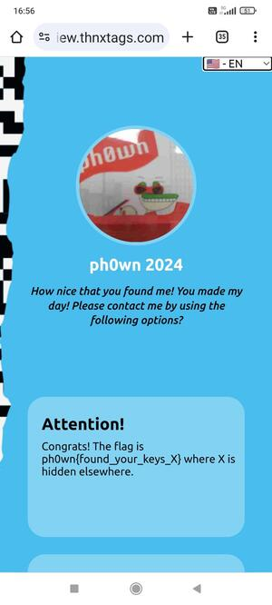

## Thnxtag by Cryptax

### Description

Pico le Croco lost the keys of his convertible car. Fortunately, they're on a Thnx Tag. Please notify him when you found them, he's likely to reward you with a flag ;-)

### Finding the tag

We find the Thnx Tag:

### QR code

The tag says "scan me", so we scan the QR code with a smartphone app such as [Privacy Friendly QR Scanner](https://f-droid.org/fr/packages/com.secuso.privacyFriendlyCodeScanner/) [GitHub](https://github.com/SecUSo/privacy-friendly-qr-scanner). 

It provides us this URL: https://tag.thnxtags.com/672ee5e4-21a3-400e-a2c1-d880305045c9. We visit the URL:

We get a partial flag: `ph0wn{found_your_keys_X}` where X is hidden elsewhere.

### NFC

From the [help pages of thnxtags](https://en.thnxtags.com/pages/help), we see the tags also have a **NFC** chip. So, we need to scan NFC. There are several options:

- Using a NFC app, such as [NFC Tools](https://play.google.com/store/apps/details?id=com.wakdev.wdnfc), on a NFC-capable smartphone.
- Using a Flipper Zero
- Using any other sort of NFC reader...

There is a text/plain note which says "X=nicemustang".

We can also find the note by reading the memory "raw":

Note the hex chars `583d6e6963656d757374616e67` starting at Address 6 and ending at Address 9.

Or you can see it on the Flipper Zero:

And decode the ASCII with [CyberChef Hex](https://gchq.github.io/CyberChef/#recipe=From_Hex('None')&input=NTgzZDZlNjk2MzY1NmQ3NTczNzQ2MTZlNjc).

### Flag

We have both parts of the flag: `ph0wn{found_your_keys_X}` and `X=nicemustang`. So the flag is `ph0wn{found_your_keys_nicemustang}`.
